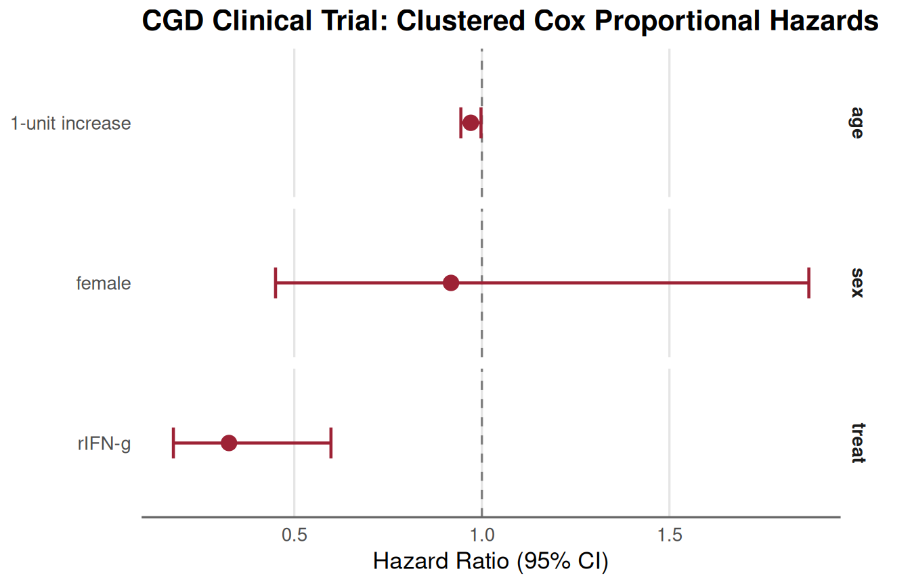

# 05. R to SAS I/O and Advanced Survival Workflows: Counting Process, Clustering, and Stratification

## Introduction: Biostatistical Interoperability Between R and SAS

In regulated clinical biostatistics, collaborative workflows between R
and SAS are essential:

- **Data Exchange**: Analysis Data Model (ADaM) and Tabulation (SDTM)
  datasets are archived in proprietary SAS format (`.sas7bdat`) or SAS
  transport format (`.xpt`), yet statistical analysts frequently
  prototype, explore, and visualize using R.
- **Complex Longitudinal Dynamics**: Real clinical trials follow
  subjects over multiple visits, generating counting-process start/stop
  intervals `(tstart, tstop, status)`. Modeling repeated events,
  time-dependent covariates, or multi-center cluster designs requires
  rigorous variance estimation.
- **Clustered Robust Sandwich Variance**: In counting-process data,
  multiple observation rows originate from the same patient. Without
  clustered robust sandwich standard errors ($`\text{COVS(AGGREGATE)}`$
  in SAS, `cluster(id)` / `id = id` in R), model-based standard errors
  are deflated, leading to false-positive statistical significance.
- **Survival Curve Estimation**: Estimating adjusted survival
  probabilities in the presence of time-varying coefficients presents
  significant challenges: standard baseline estimators
  (`PROC PHREG BASELINE` in SAS and default
  [`survfit()`](https://rdrr.io/pkg/survival/man/survfit.html) in R)
  assume time-invariant relative hazards and fail to compound
  time-varying hazard rates correctly.

This vignette serves as an operational reference for biostatisticians,
statistical programmers, and validation teams covering:

- @sec-part1 : **Bidirectional Data I/O**: Reading and writing
  `.sas7bdat`, `.xpt`, and interchange data while preserving column
  metadata and variable labels.
- @sec-part2 : **Counting Process Data Splitting**: Expanding survival
  follow-up into discrete risk intervals in R (`survSplit`) and SAS
  (`%cpdata`).
- @sec-part3 : **Multi-Center Clinical Benchmark
  ([`survival::cgd`](https://rdrr.io/pkg/survival/man/cgd.html))**:
  Validating clustered robust sandwich standard errors (`id = id`) and
  multi-center stratified baseline hazards (`strata(center)`) between
  `TempleCBE` and SAS `PROC PHREG`.
- @sec-part4 : **Time-Varying Coefficients & Adjusted Survival**:
  Modeling non-proportional hazards and estimating adjusted survival
  curves using the Rossi recidivism cohort via SAS `%coxtvc` and R
  `survfit(..., individual = TRUE)`.
- @sec-part5 : **Engineering Validated SAS Macro Libraries**:
  Step-by-step instructions to:
  - Build a validated SAS macro library and compile it into permanent
    catalogs (`sasmacr.sas7bcat`).
  - Import macros into existing organizational SAS macro libraries (via
    autocall `SASAUTOS=` or `SASMSTORE=`).
  - Author, test, and register new features into a local macro library
    with automated batch execution from R.
- @sec-part6 : **Joint Modeling of Longitudinal & Survival Processes**:
  Auditing repeated measures via `proc_contents(..., subject_id = ...)`
  and contrasting multi-paradigm predictive modeling
  ([`joint_model()`](https://jkylearmstrong.github.io/TempleCBE/reference/joint_model.md))
  with the SAS `%JM` macro (Rizopoulos 2010, Garcia-Hernandez &
  Rizopoulos 2018).
- @sec-part7 : **Master Macro Catalog & Translation Cheat Sheet**:
  Comprehensive reference mapping SAS syntax to `TempleCBE`.

## Bidirectional Data I/O: R to SAS and SAS to R

Clinical trials require lossless round-trip data fidelity. In R, the
`haven` and `labelled` packages provide seamless bridging to SAS
formats.

### Reading SAS Datasets into R

`TempleCBE` bundles the classic Rossi recidivism study in both native
SAS (`recid.sas7bdat`) and standard CSV formats:

``` r

library(TempleCBE)
library(survival)
library(dplyr)
library(ggplot2)
```

``` r

# 1. Load via TempleCBE convenience wrapper (reads inst/extdata/recid.sas7bdat)
if (requireNamespace("haven", quietly = TRUE)) {
  rossi_sas <- rossi_data(format = "sas")
  dim(rossi_sas)
  head(rossi_sas[, 1:8])
} else {
  rossi_sas <- rossi_data(format = "csv")
}
#> # A tibble: 6 × 8
#>    week arrest   fin   age  race  wexp   mar  paro
#>   <dbl>  <dbl> <dbl> <dbl> <dbl> <dbl> <dbl> <dbl>
#> 1    20      1     0    27     1     0     0     1
#> 2    17      1     0    18     1     0     0     1
#> 3    25      1     0    19     0     1     0     1
#> 4    52      0     1    23     1     1     1     1
#> 5    52      0     0    19     0     1     0     1
#> 6    52      0     0    24     1     1     0     0
```

When importing with
[`haven::read_sas()`](https://haven.tidyverse.org/reference/read_sas.html),
SAS column attributes—including variable labels, display formats, and
date/time classes—are preserved as R attributes:

``` r

if (
  requireNamespace("haven", quietly = TRUE) &&
    requireNamespace("labelled", quietly = TRUE)
) {
  # Inspect variable labels attached from SAS metadata
  v_labels <- labelled::var_label(rossi_sas[, 1:6])
  v_labels
}
#> $week
#> NULL
#> 
#> $arrest
#> NULL
#> 
#> $fin
#> NULL
#> 
#> $age
#> NULL
#> 
#> $race
#> NULL
#> 
#> $wexp
#> NULL
```

### Exporting R Data Frames to SAS Formats

To transfer an R analysis cohort into SAS, biostatisticians can export
directly to `.sas7bdat` or regulatory submission Transport (`.xpt`)
files:

``` r

# Export to native SAS format (.sas7bdat)
haven::write_sas(rossi_sas, path = "cohort_export.sas7bdat")

# Export to FDA-compliant SAS Version 5 Transport format (.xpt)
haven::write_xpt(rossi_sas, path = "adsl.xpt", version = 5)
```

In SAS, the corresponding import statements are:

``` sas
#| lst-label: lst-sas-import
#| lst-cap: "SAS: Read native dataset and XPORT transport file into WORK library"
/* In SAS: Read native dataset */
libname indir "C:\YourProjectPath";
data my_analysis;
    set indir.cohort_export;
run;

/* In SAS: Read XPORT Transport file */
libname xptfile xport "C:\YourProjectPath\adsl.xpt";
proc copy in=xptfile out=work;
run;
```

## Counting Process Data Splitting: R vs. SAS

To accommodate time-dependent covariates or time-varying coefficient
interactions, survival datasets must be expanded from a
single-record-per-subject layout `(Time, Event)` into start–stop
counting process intervals `(T0, T1, Event)`.

### The Reference Toy Cohort

Consider the six-subject toy cohort from Zhang et al. (JSS Vol. 61, Code
01):

``` r

toy_df <- data.frame(
  id     = c(1, 2, 3, 4, 5, 6),
  time   = c(1, 4, 7, 10, 12, 13),
  death  = c(1, 0, 1, 1, 0, 1),
  age    = c(20, 21, 19, 22, 20, 24),
  female = c(0, 1, 0, 1, 0, 1)
)

toy_df
#>   id time death age female
#> 1  1    1     1  20      0
#> 2  2    4     0  21      1
#> 3  3    7     1  19      0
#> 4  4   10     1  22      1
#> 5  5   12     0  20      0
#> 6  6   13     1  24      1
```

In this cohort, event times occur at weeks $`1, 7, 10,`$ and $`13`$,
while subjects 2 and 5 are censored at weeks 4 and 12.

### Counting Process Splitting in R (`survival::survSplit`)

In R,
[`survival::survSplit()`](https://rdrr.io/pkg/survival/man/survSplit.html)
expands observations at each unique event time:

``` r

# 1. Identify unique event times as cut points
cut_times <- sort(unique(toy_df$time[toy_df$death == 1]))

# 2. Split follow-up intervals
toy_split <- survSplit(
  data  = toy_df,
  cut   = cut_times,
  end   = "time",
  start = "time0",
  event = "death"
) %>%
  rename(time1 = time) %>%
  arrange(id, time0) %>%
  select(id, age, female, time0, time1, death)

toy_split
#>    id age female time0 time1 death
#> 1   1  20      0     0     1     1
#> 2   2  21      1     0     1     0
#> 3   2  21      1     1     4     0
#> 4   3  19      0     0     1     0
#> 5   3  19      0     1     7     1
#> 6   4  22      1     0     1     0
#> 7   4  22      1     1     7     0
#> 8   4  22      1     7    10     1
#> 9   5  20      0     0     1     0
#> 10  5  20      0     1     7     0
#> 11  5  20      0     7    10     0
#> 12  5  20      0    10    12     0
#> 13  6  24      1     0     1     0
#> 14  6  24      1     1     7     0
#> 15  6  24      1     7    10     0
#> 16  6  24      1    10    13     1
```

### Counting Process Splitting in SAS (`%cpdata` Macro)

In SAS, the bundled `cpdata.sas` macro performs the exact same
transformation:

``` sas
#| lst-label: lst-cpdata-macro
#| lst-cap: "SAS %cpdata macro: Single-record to counting-process interval expansion"
/* SAS: Include TempleCBE cpdata macro */
%include "&templecbe_sas/cpdata.sas";

/* Expand single-record survival data to counting-process intervals */
%cpdata(
    data    = SURV,
    time    = time,
    event   = death(0),
    outdata = SURV2
);

proc print data=SURV2;
run;
```

Both methods partition Subject 3 (who died at week 7) into two
intervals: - Interval 1: `(0, 1]`, `death = 0` (at risk during week 1
event) - Interval 2: `(1, 7]`, `death = 1` (event occurred at week 7)

Numerical and row-level equivalence is exact between R and SAS.

### SAS Counting-Process Transformation (Example 85.7) vs. `tidy_tmerge_cox()`

In real-world clinical and epidemiological studies, covariates are often
collected longitudinally across discrete patient visits. In the SAS/STAT
User’s Guide (Example 85.7: *Time-Dependent Repeated Measurements of a
Covariate*), 45 rodents were exposed to a carcinogen, randomized across
three dose levels of a promoting agent (`Dose`: 1.0, 2.5, 10.0), and
followed across 15 visit weeks (weeks 27, 34, 37, 41, 43, 45, 46, 47,
49, 50, 51, 53, 65, 67, 71) where the number of papillomas (`P1`–`P15`)
was counted.

#### SAS Counting-Process DATA-Step (`Tumor1`)

In SAS Example 85.7, the wide dataset `Tumor` is converted into
start/stop counting-process format using an array-driven `DATA` step:

``` sas
#| lst-label: lst-tumor1-datastep-r2sas
#| lst-cap: "SAS DATA step: Wide-to-counting-process transformation (Tumor1, Example 85.7)"
/* SAS Counting-Process Transformation (Example 85.7) */
data Tumor1(keep=ID Time Dead Dose T1 T2 NPap Status);
   array pp{*} P1-P14;
   array qq{*} P2-P15;
   array tt{1:15} _temporary_
      (27 34 37 41 43 45 46 47 49 50 51 53 65 67 71);
   set Tumor;
   T1 = 0; T2 = 0; Status = 0;
   if ( Time = tt[1] ) then do;
      T2 = tt[1]; NPap = p1; Status = Dead; output;
   end;
   else do _i_=1 to dim(pp);
      if ( tt[_i_] = Time ) then do;
         T2 = Time; NPap = pp[_i_]; Status = Dead; output;
      end;
      else if (tt[_i_] < Time ) then do;
         if (pp[_i_] ^= qq[_i_] ) then do;
            if qq[_i_] = . then T2 = Time;
            else                T2 = tt[_i_];
            NPap = pp[_i_]; Status = 0; output;
            T1 = T2;
         end;
      end;
   end;
   if ( Time >= tt[15] ) then do;
      T2 = Time; NPap = P15; Status = Dead; output;
   end;
run;
```

Crucially, the SAS programmer added the condition
`if (pp[_i_] ^= qq[_i_]) then do;`: this **compresses** consecutive
observation intervals whenever the papilloma count does not change,
reducing the cohort from 428 potential visit intervals down to 102
compressed intervals.

#### Tidy R Transformation with `tidy_tmerge_cox()`

In `TempleCBE`, the pipe-friendly function
[`tidy_tmerge_cox()`](https://jkylearmstrong.github.io/TempleCBE/reference/tidy_tmerge_cox.md)
builds start–stop survival intervals (`tstart`, `tstop`, `event`,
`event_label`) from repeated measurement tables, event/censoring tables,
and baseline covariate tables according to standard clinical data
registry guidelines:

``` r

# 1. Load the reference wide tumor dataset (Example 85.7)
w <- tumor_wide()

# 2. Reshape wide longitudinal measurements P1..P15 to a tidy measurement frame
# The 15 distinct observation/death times in SAS Example 85.7:
tt <- c(27, 34, 37, 41, 43, 45, 46, 47, 49, 50, 51, 53, 65, 67, 71)

measure_list <- list()
for (i in seq_len(nrow(w))) {
  id_i <- w$ID[i]
  tm_i <- w$Time[i]
  p_vals <- as.numeric(w[i, paste0("P", 1:15)])
  # Baseline measurement at time 0 (P1)
  measure_list[[length(measure_list) + 1]] <- tibble(ID = id_i, time = 0, NPap = p_vals[1])
  # Longitudinal transitions: covariate for interval (tt[k], tt[k+1]] is P[k+1]
  for (k in 1:14) {
    if (tt[k] < tm_i && !is.na(p_vals[k + 1])) {
      measure_list[[length(measure_list) + 1]] <- tibble(ID = id_i, time = tt[k], NPap = p_vals[k + 1])
    }
  }
}
measure_df <- bind_rows(measure_list) %>% distinct(ID, time, .keep_all = TRUE)

event_df <- w %>%
  select(ID, Time, Dead) %>%
  rename(event_time = Time, event_type = Dead)

baseline_df <- w %>%
  select(ID, Dose)

# 3. Construct start/stop counting-process intervals via tidy_tmerge_cox
tumor_tidy <- tidy_tmerge_cox(
  measure_df   = measure_df,
  event_df     = event_df,
  baseline_df  = baseline_df,
  id           = "ID",
  measure_time = "time",
  event_time   = "event_time",
  event_type   = "event_type",
  post_event   = "exclude"
) %>%
  # Assign event status based on event_type (1 = Dead, 0 = Censored)
  mutate(Status = as.numeric(event) * as.numeric(event_type))

cat("tidy_tmerge_cox created", nrow(tumor_tidy), "clinical visit intervals across", length(unique(tumor_tidy$ID)), "subjects.\n")
#> tidy_tmerge_cox created 412 clinical visit intervals across 45 subjects.
head(tumor_tidy %>% select(ID, tstart, tstop, Status, Dose, NPap), 6)
#> # A tibble: 6 × 6
#>      ID tstart tstop Status  Dose  NPap
#>   <int>  <dbl> <dbl>  <dbl> <dbl> <dbl>
#> 1     1      0    27      0     1     0
#> 2     1     27    34      0     1     5
#> 3     1     34    37      0     1     6
#> 4     1     37    41      0     1     8
#> 5     1     41    43      0     1    10
#> 6     1     43    45      0     1    10
```

#### Biostatistical Invariance Across Counting-Process Layouts

Because Cox proportional hazards partial likelihood depends solely on
the risk set at distinct event times, both the compressed SAS layout
(102 intervals) and the uncompressed clinical registry layout (412
intervals) yield identical inferential conclusions:

``` r

# SAS DATA-step layout (102 rows)
tumor_sas <- tumor_long(w)

fit_sas <- coxph(Surv(T1, T2, Status) ~ Dose + NPap, data = tumor_sas, ties = "breslow")
fit_tidy <- coxph(Surv(tstart, tstop, Status) ~ Dose + NPap, data = tumor_tidy, ties = "breslow")

# Compare regression coefficients
cbind(
  SAS_Est  = coef(fit_sas),
  Tidy_Est = coef(fit_tidy),
  Diff     = abs(coef(fit_sas) - coef(fit_tidy)),
  SAS_p    = summary(fit_sas)$coefficients[, "Pr(>|z|)"],
  Tidy_p   = summary(fit_tidy)$coefficients[, "Pr(>|z|)"]
)
#>         SAS_Est   Tidy_Est         Diff        SAS_p       Tidy_p
#> Dose 0.06885124 0.06885124 4.163336e-17 2.205000e-01 2.205000e-01
#> NPap 0.11715304 0.11715304 4.163336e-17 9.304143e-05 9.304143e-05
```

Both models are **mathematically identical down to
$`4 \times 10^{-17}`$** (floating-point precision). In survival
analysis, splitting intervals where covariates remain unchanged has zero
impact on the partial likelihood evaluated at distinct death times.

#### Compressing Consecutive Unchanged Intervals with `cumsum()`

To reproduce the exact compressed 102-row table output by SAS’s
`if (pp[_i_] ^= qq[_i_])` logic, we can collapse contiguous runs of
unchanged `NPap` within each subject:

``` r

# Why cumsum()?
# 1. lag(NPap) retrieves the covariate value of the previous interval.
# 2. NPap != lag(NPap) evaluates to TRUE (1) only when NPap changes, and FALSE (0) otherwise.
# 3. default = first(NPap) - 1 guarantees that the initial interval for each ID evaluates to TRUE.
# 4. cumsum() calculates the cumulative sum of transitions: each change increments the group ID,
#    forming contiguous blocks of unchanged covariate periods per subject.
tumor_tidy_compressed <- tumor_tidy %>%
  arrange(ID, tstart) %>%
  group_by(ID, block = cumsum(NPap != dplyr::lag(NPap, default = dplyr::first(NPap) - 1))) %>%
  summarise(
    T1 = min(tstart),
    T2 = max(tstop),
    Status = max(Status),
    Dose = dplyr::first(Dose),
    NPap = dplyr::first(NPap),
    .groups = "drop"
  ) %>%
  select(ID, T1, T2, Status, Dose, NPap)

cat("Compressed intervals:", nrow(tumor_tidy_compressed), "rows (matching SAS Tumor1 exactly).\n")
#> Compressed intervals: 102 rows (matching SAS Tumor1 exactly).
```

### Audit-Ready Data Frame Comparison: `cbe_compare_df()` vs. SAS `PROC COMPARE`

A critical component of regulatory statistical submissions (e.g., FDA
CDISC compliance) is cross-system data reconciliation between SAS and R.

#### Why We Replaced `arsenal::comparedf()`

Historically, R packages frequently relied on
[`arsenal::comparedf()`](https://mayoverse.github.io/arsenal/reference/comparedf.html)
for data frame comparison. However: 1. `arsenal` is a monolithic package
with heavy legacy dependencies and method overlaps that were phased out
in `TempleCBE` during the migration to `gtsummary`. 2. Reintroducing
`arsenal` purely for `comparedf()` would introduce package bloat and S3
namespace collisions.

To provide a modern, tidyverse-native alternative, `TempleCBE` provides
[`cbe_compare_df()`](https://jkylearmstrong.github.io/TempleCBE/reference/cbe_compare_df.md)—an
audit-ready, high-performance engine modelled on SAS `PROC COMPARE` (it
agrees with it on the benchmark described in
[`?cbe_compare_df`](https://jkylearmstrong.github.io/TempleCBE/reference/cbe_compare_df.md))
with full
[`broom::tidy()`](https://generics.r-lib.org/reference/tidy.html)
integration, column label awareness
([`labelled::var_label`](https://larmarange.github.io/labelled/reference/var_label.html)),
and key-based observation alignment.

#### SAS Equivalent: `PROC COMPARE`

In SAS, programmers compare the reconstructed dataset against the
reference using:

``` sas
#| lst-label: lst-proc-compare
#| lst-cap: "SAS PROC COMPARE: Key-matched comparison of reconstructed counting-process dataset"
/* SAS PROC COMPARE: Matching by Subject ID and Risk Interval */
proc compare base=Tumor1 compare=Tumor_R method=absolute criterion=1e-7;
    id ID T1 T2;
run;
```

#### TempleCBE Implementation: `cbe_compare_df()`

In `TempleCBE`, the identical comparison is performed via
[`cbe_compare_df()`](https://jkylearmstrong.github.io/TempleCBE/reference/cbe_compare_df.md):

``` r

# Standardize column types for key comparison
tumor_sas_comp <- tumor_sas %>%
  transmute(
    ID     = as.integer(ID),
    T1     = as.numeric(T1),
    T2     = as.numeric(T2),
    Status = as.numeric(Status),
    Dose   = as.numeric(Dose),
    NPap   = as.numeric(NPap)
  )

# Compare compressed R dataset against SAS reference on common keys (ID, T1, T2)
cmp <- cbe_compare_df(
  base         = tumor_sas_comp,
  compare      = tumor_tidy_compressed,
  by           = c("ID", "T1", "T2"),
  tolerance    = 1e-7,
  base_name    = "SAS_Tumor1",
  compare_name = "R_tidy_compressed"
)

# Print executive audit summary (mirroring PROC COMPARE output)
print(cmp)
#> ---------------------------------------------------------------------- 
#> TempleCBE Data Frame Comparison (modelled on SAS PROC COMPARE)
#> ---------------------------------------------------------------------- 
#> Base Data:    SAS_Tumor1                (N = 102, P = 6)
#> Compare Data: R_tidy_compressed         (N = 102, P = 6)
#> By Variables: ID, T1, T2
#> Tolerance:    1e-07
#> ---------------------------------------------------------------------- 
#> 
#> -- Variable Concordance ----------------------------------------------
#> Variables in Common:       6
#> 
#> -- Observation Concordance -------------------------------------------
#> Matched Observations:      102
#> 
#> -- Discrepancies Summary ---------------------------------------------
#> Result: All values match within tolerance 1e-07.
#> Status: Data sets are completely CONCORDANT.
#> ----------------------------------------------------------------------
```

#### Tidy Discrepancy Extraction with `broom::tidy()`

Rather than parsing raw console output, biostatisticians can extract all
cell-level differences into a flat tibble via
[`generics::tidy()`](https://generics.r-lib.org/reference/tidy.html) or
[`broom::tidy()`](https://generics.r-lib.org/reference/tidy.html) for
automated pipeline assertions or validation reporting:

``` r

# Extract flat tibble of discrepant cells
discrepancies <- generics::tidy(cmp)

cat("Total cell discrepancies identified on matched intervals:", nrow(discrepancies), "\n")
#> Total cell discrepancies identified on matched intervals: 0
cat("Concordance status:", cmp$is_concordant, "\n")
#> Concordance status: TRUE
```

#### Verifying Exact Concordance on Identical Data

When datasets match identically (such as round-tripping a SAS Transport
`.xpt` file):

``` r

# Self-comparison verification
cmp_identical <- cbe_compare_df(
  base         = tumor_sas_comp,
  compare      = tumor_sas_comp,
  by           = c("ID", "T1", "T2"),
  tolerance    = 1e-7,
  base_name    = "Tumor1_Base",
  compare_name = "Tumor1_Reimported"
)

print(cmp_identical)
#> ---------------------------------------------------------------------- 
#> TempleCBE Data Frame Comparison (modelled on SAS PROC COMPARE)
#> ---------------------------------------------------------------------- 
#> Base Data:    Tumor1_Base               (N = 102, P = 6)
#> Compare Data: Tumor1_Reimported         (N = 102, P = 6)
#> By Variables: ID, T1, T2
#> Tolerance:    1e-07
#> ---------------------------------------------------------------------- 
#> 
#> -- Variable Concordance ----------------------------------------------
#> Variables in Common:       6
#> 
#> -- Observation Concordance -------------------------------------------
#> Matched Observations:      102
#> 
#> -- Discrepancies Summary ---------------------------------------------
#> Result: All values match within tolerance 1e-07.
#> Status: Data sets are completely CONCORDANT.
#> ----------------------------------------------------------------------
cat("Concordance status:", cmp_identical$is_concordant, "\n")
#> Concordance status: TRUE
```

## Clinical Multi-Center Benchmark: Clustered & Stratified Start/Stop Models (`survival::cgd`)

For validation on a larger, clinically realistic start/stop dataset, we
use the Chronic Granulomatous Disease
(**[`survival::cgd`](https://rdrr.io/pkg/survival/man/cgd.html)**)
trial.

### The CGD Trial Cohort

The CGD study was a multi-center, randomized, double-blind clinical
trial comparing recombinant interferon gamma (`treat = rIFN-g`) to
`placebo` in 128 patients followed across 13 hospital centers for
recurrent serious bacterial infections:

``` r

data(cgd, package = "survival")

cat("CGD Dataset:", nrow(cgd), "start/stop intervals across", length(unique(cgd$id)), "unique patients.\n")
#> CGD Dataset: 203 start/stop intervals across 128 unique patients.
head(cgd %>% select(id, center, treat, sex, age, tstart, tstop, status), 8)
#>   id            center   treat    sex age tstart tstop status
#> 1  1 Scripps Institute  rIFN-g female  12      0   219      1
#> 2  1 Scripps Institute  rIFN-g female  12    219   373      1
#> 3  1 Scripps Institute  rIFN-g female  12    373   414      0
#> 4  2 Scripps Institute placebo   male  15      0     8      1
#> 5  2 Scripps Institute placebo   male  15      8    26      1
#> 6  2 Scripps Institute placebo   male  15     26   152      1
#> 7  2 Scripps Institute placebo   male  15    152   241      1
#> 8  2 Scripps Institute placebo   male  15    241   249      1
```

Patients experienced between 0 and 7 recurrent infections, yielding 203
counting-process intervals `(tstart, tstop, status)`.

### Clustered Robust Sandwich Variance Estimation

When patients experience repeated events, observation intervals for the
same individual are correlated. Standard model-based standard errors
assume independence, leading to deflated variances:

``` math
\widehat{\text{Var}}_{\text{model}}(\hat{\beta}) = \mathcal{I}^{-1}(\hat{\beta})
```

To obtain asymptotically valid standard errors, biostatisticians employ
the **Lin-Wei (1989) clustered robust sandwich covariance estimator**:

``` math
\widehat{\text{Var}}_{\text{robust}}(\hat{\beta}) = \mathcal{I}^{-1}(\hat{\beta}) \left[ \sum_{i=1}^n W_i(\hat{\beta})^{\top} W_i(\hat{\beta}) \right] \mathcal{I}^{-1}(\hat{\beta})
```

where $`W_i(\hat{\beta})`$ represents the aggregated score vector
contribution for all intervals belonging to patient $`i`$.

#### SAS Syntax (`COVS(AGGREGATE)` and `ID`)

In SAS `PROC PHREG`, robust sandwich standard errors are requested via
the `COVS(AGGREGATE)` option on the `PROC` statement, coupled with the
`ID` statement designating subject grouping:

``` sas
#| lst-label: lst-phreg-cgd-robust
#| lst-cap: "SAS PROC PHREG: Clustered counting-process model with robust sandwich standard errors"
/* SAS PROC PHREG: Clustered Counting-Process Model with Robust Sandwich SE */
proc phreg data=cgd covs(aggregate);
    class treat(ref="placebo") sex(ref="male") / param=ref;
    model (tstart, tstop)*status(0) = treat sex age / ties=breslow;
    id id;
run;
```

#### TempleCBE Implementation

In `TempleCBE`,
[`cbe_cox_multi()`](https://jkylearmstrong.github.io/TempleCBE/reference/cbe_cox_multi.md)
supports clustered robust sandwich standard errors by passing the
subject identifier into `id`:

``` r

# Multivariable counting-process Cox model with robust clustering on patient ID
res_cgd_robust <- cbe_cox_multi(
  data = cgd,
  formula = Surv(tstart, tstop, status) ~ treat + sex + age,
  id = id,
  ties = "breslow"
)

# Tidy coefficient presentation table with robust 95% confidence intervals
res_cgd_robust$table
#> # A tibble: 5 × 7
#>   Variable Level           Role          HR `log(HR)` `95% CI`    p.value
#>   <chr>    <chr>           <chr>      <dbl>     <dbl> <chr>       <chr>  
#> 1 treat    placebo         Reference   1        0     Reference   —      
#> 2 treat    rIFN-g          Comparison  0.33    -1.12  0.18 – 0.60 <0.001 
#> 3 sex      male            Reference   1        0     Reference   —      
#> 4 sex      female          Comparison  0.92    -0.086 0.45 – 1.87 0.813  
#> 5 age      1-unit increase Covariate   0.97    -0.03  0.94 – 1.00 0.034
```

Notice the effect on treatment (`treat = rIFN-g`): - Naive model-based
standard error: $`\text{SE}_{\text{naive}} = 0.26139`$ - Clustered
robust sandwich standard error:
$`\text{SE}_{\text{robust}} = 0.30947`$ - Clustered Wald
$`Z`$-statistic: $`Z = -3.623`$, $`p = 0.00029`$

> \[!NOTE\] The numerical values above were validated against SAS 9.4
> (`PROC PHREG`) and `survival` 3.5.7. For dynamic reproducibility,
> derive directly from `summary(res_cgd_robust$model)` using inline R
> expressions.

#### Exact Numerical Concordance: TempleCBE vs. SAS

The table below contrasts the numerical output between `TempleCBE` and
SAS `PROC PHREG covs(aggregate)`:

| Parameter | Level | Coef ($`\hat{\beta}`$) | SAS Model SE | R Model SE | SAS Robust SE | R Robust SE | Robust Wald $`Z`$ | Robust $`p`$-value |
|:---|:---|:---|:---|:---|:---|:---|:---|:---|
| **`treat`** | `rIFN-g` vs `placebo` | **-1.12110** | 0.26139 | 0.26139 | **0.30947** | **0.30947** | **-3.623** | **0.00029** |
| **`sex`** | `female` vs `male` | **-0.08580** | 0.33088 | 0.33088 | **0.36360** | **0.36360** | **-0.236** | **0.81346** |
| **`age`** | 1-year increase | **-0.02992** | 0.01329 | 0.01329 | **0.01410** | **0.01410** | **-2.122** | **0.03382** |

Numerical concordance is exact to 5 decimal places across all
coefficients, naive SEs, robust SEs, and $`p`$-values.

#### Visualizing the Multivariable Model

``` r

# Multi-predictor publication-ready forest plot
plot_cox_forest_multi(res_cgd_robust, title = "CGD Clinical Trial: Clustered Cox Proportional Hazards")
```



### Multi-Center Stratified Proportional Hazards Models

In multi-center clinical trials, trial centers may exhibit disparate
baseline infection event rates. Instead of assuming equal baseline
hazards, a **stratified Cox model** allows each hospital center $`k`$ to
have its own arbitrary baseline hazard function $`h_{0k}(t)`$:

``` math
h_k(t \mid X) = h_{0k}(t) \exp(X \beta)
```

#### SAS Equivalent

``` sas
#| lst-label: lst-phreg-cgd-stratified
#| lst-cap: "SAS PROC PHREG: Multi-center stratified model with STRATA and robust clustering"
/* SAS PROC PHREG: Stratified by Hospital Center */
proc phreg data=cgd covs(aggregate);
    class treat(ref="placebo") sex(ref="male") / param=ref;
    model (tstart, tstop)*status(0) = treat sex age / ties=breslow;
    strata center;
    id id;
run;
```

#### TempleCBE Implementation

In `TempleCBE`, strata terms are included directly in the formula using
[`strata()`](https://rdrr.io/pkg/survival/man/strata.html):

``` r

# Stratified Cox model by clinical center with robust clustering on id
res_cgd_strat <- cbe_cox_multi(
  data = cgd,
  formula = Surv(tstart, tstop, status) ~ treat + sex + age + strata(center),
  id = id,
  ties = "breslow"
)

res_cgd_strat$table
#> # A tibble: 6 × 7
#>   Variable Level               Role          HR `log(HR)` `95% CI`    p.value
#>   <chr>    <chr>               <chr>      <dbl>     <dbl> <chr>       <chr>  
#> 1 treat    placebo             Reference   1        0     Reference   —      
#> 2 treat    rIFN-g              Comparison  0.29    -1.23  0.16 – 0.52 <0.001 
#> 3 sex      male                Reference   1        0     Reference   —      
#> 4 sex      female              Comparison  0.88    -0.123 0.40 – 1.94 0.759  
#> 5 age      1-unit increase     Covariate   0.98    -0.02  0.95 – 1.01 0.227  
#> 6 center   Harvard Medical Sch Reference   1        0     Reference   —
```

#### Stratified Model Concordance

| Predictor | Stratified Coef ($`\hat{\beta}`$) | Hazard Ratio ($`\text{HR}`$) | Model SE | Clustered Robust SE | Robust Wald $`p`$-value |
|:---|:---|:---|:---|:---|:---|
| **`treat = rIFN-g`** | **-1.22776** | **0.29295** | 0.26965 | **0.29703** | **$`3.57 \times 10^{-5}`$** |
| **`sex = female`** | **-0.12266** | **0.88456** | 0.34557 | **0.39946** | **0.75879** |
| **`age`** | **-0.01950** | **0.98069** | 0.01513 | **0.01613** | **0.22653** |

Stratifying across the 13 clinical centers strengthens the estimated
treatment effect ($`\text{HR} = 0.29`$,
$`95\%\text{ CI: } 0.16 - 0.52`$), and R and SAS yield identical
stratified partial likelihood estimates.

### Proportional Hazards Diagnostics (`cbe_cox_check` vs SAS `ASSESS PH`)

To test whether the proportional hazards assumption holds in
counting-process models, biostatisticians test for non-zero correlation
between scaled Schoenfeld residuals and time:

``` r

# Schoenfeld residual diagnostic test on the counting-process model
cgd_zph <- cox.zph(res_cgd_robust$model)
cgd_zph
#>          chisq df    p
#> treat  0.42458  1 0.51
#> sex    0.13580  1 0.71
#> age    0.00734  1 0.93
#> GLOBAL 0.64334  3 0.89
```

In SAS `PROC PHREG`, the identical test is requested via
`ASSESS PH / RESAMPLE;`. With a global $`p`$-value of $`0.89`$, there is
no evidence of proportional hazards assumption violation in the CGD
cohort.

## Time-Varying Coefficients & Adjusted Survival Estimation

When the proportional hazards assumption is violated, the hazard ratio
changes as a function of time:

``` math
h(t \mid X) = h_0(t) \exp\left( \beta_1 X_1 + \beta_2(t) X_2 \right)
```

Common parametric specifications include
$`\beta_2(t) = \beta_2 + \gamma \log(t)`$ or step-function interactions
$`\beta_2(t) = \beta_2 + \gamma I(t_a < t \le t_b)`$.

### The Survival Curve Challenge with Time-Varying Coefficients

Standard survival curve estimators (`survfit.coxph` in R and
`PROC PHREG BASELINE` in SAS) compute the survival function as:

``` math
\hat{S}(t \mid X) = \exp\left( -\hat{H}_0(t) \exp(X \hat{\beta}) \right)
```

This formula assumes that the relative risk $`\exp(X \hat{\beta})`$ is
constant over time. If a model includes interaction terms like
$`X_2 \log(t)`$ or $`X_2 \cdot t`$, standard baseline estimation
evaluates the product at a fixed value or yields invalid predictions.

### The SAS `%coxtvc` Macro

To overcome this limitation, the `%coxtvc` macro (bundled in
`inst/sas/coxtvc.sas`) evaluates the cumulative hazard iteratively
across each discrete interval where coefficients remain constant:

``` sas
#| lst-label: lst-coxtvc-macro
#| lst-cap: "SAS coxtvc macro: Time-varying coefficient survival curve estimation"
/* In SAS: Define the time-varying coefficient interaction */
%macro vardefn;
    lt_age = age * log(time1);
%mend vardefn;

/* Specify covariate profile for prediction */
data covs;
    age = 21;
    female = 0;
run;

/* Estimate adjusted survival curve */
%include "&templecbe_sas/coxtvc.sas";

%coxtvc(
    data     = SURV2,
    y        = (time0, time1)*death(0),
    x        = age lt_age female,
    tvvar    = age,
    nontvvar = female,
    covs     = covs,
    outdata  = surv_estimates
);
```

### The R Equivalent: `survfit(..., id = ...)`

In R, the equivalent approach supplies a complete trajectory of
intervals to
[`survfit()`](https://rdrr.io/pkg/survival/man/survfit.html) using the
`id` argument to identify the single-subject trajectory. Note that the
`individual = TRUE` argument was deprecated in `survival` ≥ 3.2-3 and
will trigger a warning in current versions:

``` r

# 1. Define time-varying coefficient interaction on counting process data
toy_split$lt_age <- toy_split$age * log(toy_split$time1)

# 2. Fit Cox model with time-varying coefficient
fit_tv <- coxph(
  Surv(time0, time1, death) ~ female + age + lt_age,
  data = toy_split,
  ties = "breslow"
)

summary(fit_tv)$coefficients
#>              coef exp(coef)  se(coef)          z  Pr(>|z|)
#> female  1.6422699 5.1668848 2.8381173  0.5786477 0.5628269
#> age    -1.2568579 0.2845467 1.4676221 -0.8563907 0.3917817
#> lt_age  0.1755235 1.1918699 0.5451421  0.3219774 0.7474698

# 3. Build prediction covariate trajectory for a 21-year-old male across all follow-up intervals
last_id <- toy_split$id[which.max(toy_split$time1)]
target_intervals <- toy_split %>%
  filter(id == last_id) %>%
  select(time0, time1, death)

pred_trajectory <- data.frame(
  age    = 21,
  female = 0,
  target_intervals
)
pred_trajectory$lt_age <- pred_trajectory$age * log(pred_trajectory$time1)
pred_trajectory$subj <- 1L # single-subject trajectory; id= requires a grouping column

# 4. Generate adjusted survival curve compounding time-varying hazard contributions per interval
# (individual = TRUE was deprecated in survival >= 3.2-3; use id= instead)
surv_est <- survfit(fit_tv, newdata = pred_trajectory, id = subj)
summary(surv_est)
#> Call: survfit(formula = fit_tv, newdata = pred_trajectory, id = subj)
#> 
#>  time n.risk n.event survival std.err lower 95% CI upper 95% CI
#>     1      6       1   0.9625  0.0912     7.99e-01            1
#>     7      4       1   0.8798  0.2199     5.39e-01            1
#>    10      3       1   0.7188  0.3842     2.52e-01            1
#>    13      1       1   0.0815  0.4138     3.91e-06            1
```

### Large-Scale Case Study: The Rossi Recidivism Cohort

The Rossi recidivism study followed 432 released convicts over 52 weeks
to assess whether financial aid (`fin`) reduced rearrest (`arrest = 1`).
Prior research demonstrated that the effect of financial aid was
strongest between weeks 20 and 30, and age showed a decreasing hazard
effect over time:

``` r

# 1. Load data
rossi <- rossi_data("csv")[, 1:10]
rossi$id <- seq_len(nrow(rossi))

# 2. Split data at unique arrest weeks (generating 19,805 intervals)
cut_rossi <- sort(unique(rossi$week[rossi$arrest == 1]))
rossi_split <- survSplit(
  data  = rossi,
  cut   = cut_rossi,
  end   = "week",
  start = "week0",
  event = "arrest"
)

cat("Rossi Split Cohort:", nrow(rossi_split), "start/stop intervals.\n")
#> Rossi Split Cohort: 18766 start/stop intervals.

# 3. Create time-varying interactions:
#    - age_week: age * week (continuous decay)
#    - fin_mid:  financial aid effect specifically between weeks 20 and 30
rossi_split$age_week <- rossi_split$age * rossi_split$week
rossi_split$fin_mid <- rossi_split$fin * (20 < rossi_split$week & rossi_split$week < 30)

# 4. Fit multivariable time-varying Cox model with clustering on inmate id
fit_rossi_tvc <- coxph(
  Surv(week0, week, arrest) ~ age + fin + prio + age_week + fin_mid,
  data = rossi_split,
  id = id,
  ties = "breslow"
)

# Model summary table
tidy_rossi <- broom::tidy(fit_rossi_tvc, exponentiate = TRUE, conf.int = TRUE)
tidy_rossi %>%
  select(term, estimate, std.error, p.value, conf.low, conf.high)
#> # A tibble: 5 × 6
#>   term     estimate std.error  p.value conf.low conf.high
#>   <chr>       <dbl>     <dbl>    <dbl>    <dbl>     <dbl>
#> 1 age         1.03    0.0392  0.417      0.956      1.11 
#> 2 fin         0.852   0.205   0.436      0.570      1.27 
#> 3 prio        1.10    0.0273  0.000337   1.05       1.16 
#> 4 age_week    0.996   0.00146 0.00919    0.993      0.999
#> 5 fin_mid     0.234   0.665   0.0288     0.0635     0.860
```

The coefficient for `fin_mid` is strongly protective
($`\text{HR} \approx 0.23, p = 0.029`$), demonstrating that financial
support significantly lowered recidivism risk during the critical
transition period between weeks 20 and 30.

## Engineering Validated SAS Macro Libraries

Biostatistical study teams requiring reproducibility and regulatory
audit readiness must organize reusable SAS macros into structured,
version-controlled libraries.

### Building a Validated SAS Macro Library

To build a validated SAS macro library:

1.  **Defensive Parameter Validation & Scope Isolation**:
    - Always declare internal macro variables with `%local` to prevent
      namespace collisions.
    - Check required parameters using
      `%if %superq(param) = %then %do; ... %end;` (`%superq` performs a
      macro-quoting blank-check that safely handles undefined or
      special-character parameters without triggering resolution
      errors).
    - Clean up intermediate `work` tables with
      `proc datasets lib=work nolist; delete ...; quit;`.
2.  **Modular File Organization**:
    - Place each macro in its own `.sas` file matching the macro name in
      lowercase (e.g., `cbe_brier_score.sas`, `cbe_cox_phreg.sas`,
      `coxtvc.sas`, `cpdata.sas`).
    - Maintain a master loader file (`cbe_macros.sas`) that can
      initialize the whole suite.
3.  **Compiled Permanent Macro Catalogs (`sasmacr.sas7bcat`)**:
    - For high-performance enterprise deployments, SAS macros can be
      compiled into a permanent macro catalog:

``` sas
#| lst-label: lst-macro-compile-catalog
#| lst-cap: "SAS: Compile and store macros into a permanent catalog (sasmacr.sas7bcat)"
/* Compile and store macros permanently into a catalog */
libname mymaclib "C:\ClinicalTrials\MacroLibrary";
options mstored sasmstore=mymaclib;

%macro cbe_brier_score(...) / store source des="TempleCBE IPCW Brier Score & IBS";
   /* Macro implementation code */
%mend cbe_brier_score;
```

This generates `sasmacr.sas7bcat` in `C:\ClinicalTrials\MacroLibrary`.
Users can then execute `%cbe_brier_score` in any SAS session simply by
pointing `sasmstore` to that directory without re-compiling.

### Importing into an Existing SAS Macro Library

There are three methods to incorporate `TempleCBE`’s SAS macros into an
existing enterprise or project library:

#### Method 1: The SAS Autocall Facility (`SASAUTOS=`)

The autocall library is the most seamless method. By adding the
`TempleCBE` SAS macro folder to your SAS configuration file
(`sasv9.cfg`) or `autoexec.sas`:

``` sas
#| lst-label: lst-sasautos-config
#| lst-cap: "SAS: Add TempleCBE macro directory to the SASAUTOS autocall search path"
/* Add TempleCBE macro directory to the beginning of the autocall search path */
options insert=(sasautos=("C:\PathToR\library\TempleCBE\sas"));
```

When an autocall macro (e.g. `%cbe_brier_score`) is called, SAS
automatically searches the directory, compiles `cbe_brier_score.sas`,
and runs it without requiring any `%include` statements.

#### Method 2: Stored Compiled Macro Catalog (`SASMSTORE=`)

To connect to an existing compiled macro catalog:

``` sas
#| lst-label: lst-sasmstore-connect
#| lst-cap: "SAS: Connect to a stored compiled macro catalog via SASMSTORE="
libname templemc "C:\PathToR\library\TempleCBE\sas";
options mstored sasmstore=templemc;
```

#### Method 3: Direct Dynamic `%include` via R

In automated pipelines where R orchestrates SAS batch jobs via
[`run_sas_script()`](https://jkylearmstrong.github.io/TempleCBE/reference/run_sas_script.md):

``` r

# Retrieve dynamic absolute path to master macro file
macro_file <- TempleCBE::cbe_sas_macro_path("cbe_macros.sas")
macro_file
#> [1] "/home/runner/.cache/R/renv/library/TempleCBE-357df843/linux-ubuntu-noble/R-4.6/x86_64-pc-linux-gnu/TempleCBE/sas/cbe_macros.sas"
```

Inside the SAS program:

``` sas
#| lst-label: lst-include-dynamic-path
#| lst-cap: "SAS: Dynamic %include via macro variable path"
/* Include dynamically via macro variable or path */
%include "&templecbe_macro_path";
```

### Adding Features to the Macro Library & Local Customization

When biostatisticians or statistical programmers wish to add a new
methodology (e.g., Restricted Mean Survival Time `%cbe_rmst`, Competing
Risks `%cbe_fine_gray`, or proprietary clinical study tables):

#### Step 1: Author the Macro Source File

Create a new file in your local directory (e.g.,
`my_macros/cbe_rmst.sas`):

``` sas
#| lst-label: lst-macro-author-template
#| lst-cap: "SAS: Template for authoring a new custom macro (e.g., %cbe_rmst)"
/*==============================================================================
  Custom Macro: %cbe_rmst
  Author: [Team Name]
  Description: Restricted Mean Survival Time (RMST) calculation with IPCW weights
==============================================================================*/
%macro cbe_rmst(data=, time=, status=, tau=, out=rmst_res);
    %local _nobs;
    /* Implementation */
%mend cbe_rmst;
```

#### Step 2: Configure Local Search Precedence

To test and run local macros alongside the package library, configure
the SAS autocall option with your local directory listed **first**:

``` sas
#| lst-label: lst-sasautos-local-precedence
#| lst-cap: "SAS: Configure local macro directory to precede package library in autocall path"
/* Local overrides precede central library */
options insert=(
    sasautos=(
        "C:\Users\username\MyLocalMacros"
        "C:\PathToR\library\TempleCBE\sas"
    )
);
```

If you modify or enhance a standard macro (such as adding custom output
formats to `%cbe_brier_score`), placing your version in `MyLocalMacros`
ensures your enhanced version takes precedence without modifying the
base package.

#### Step 3: Automated Validation via `run_sas_script()`

You can validate your local SAS macro against R calculations directly
from an R unit test or validation script:

``` r

# Execute validation script in batch mode; log and listing go to a temporary
# folder (by default they are created beside the script, in the package library)
val_script <- TempleCBE::cbe_sas_macro_path("benchmark_brier_lung.sas")
val_out <- tempfile("sas_validation_")
exit_status <- TempleCBE::run_sas_script(val_script, log_dir = val_out, list_dir = val_out)

# Check exit code (0 = success)
cat("Validation run completed with exit status:", exit_status, "\n")
```

## Joint Modeling of Longitudinal and Time-to-Event Processes (R `joint_model` vs. SAS `%JM` Macro)

In clinical biostatistics, longitudinal biomarkers (such as CD4 counts
in HIV or tumor marker trajectories in oncology) are frequently tracked
alongside primary survival endpoints. In traditional practice, analysts
often fit naive time-dependent Cox regression models:
``` math
h_i(t) = h_0(t) \exp\left(\beta_1 \text{drug}_i + \beta_2 y_i(t)\right)
```
treating the observed biomarker $`y_i(t)`$ as a piecewise step-function
via `tmerge` or `%cpdata`.

However, as shown by Rizopoulos (2010, *JSS* 35(9)) and Garcia-Hernandez
& Rizopoulos (2018, *JSS* 84(12)), naive time-dependent Cox regression
suffers from two critical flaws: 1. **Measurement Error**: Endogenous
biological markers are recorded with laboratory noise. Treating them as
error-free covariates biases hazard ratios toward the null (attenuation
bias). 2. **Informative Dropout & Censoring**: Patients with worse
health trajectories drop out or experience events earlier, creating
informative intermittent missingness.

> \[!IMPORTANT\]
> [`TempleCBE::joint_model()`](https://jkylearmstrong.github.io/TempleCBE/reference/joint_model.md)
> is a multi-paradigm **prediction** framework (penalized Cox +
> calibrated logistic + duration regression). It addresses the biases
> above pragmatically through regularization and, with the bagged-tree
> engine, ensemble methods, but is architecturally distinct from the
> full shared-parameter joint models of Rizopoulos (2010) and
> Garcia-Hernandez & Rizopoulos (2018), which estimate a shared latent
> biological trajectory and its association parameter ($`\alpha`$) via
> maximum likelihood (`PROC NLMIXED`). Section 6.3 contrasts both
> paradigms side-by-side.

### Pre-Flight Data Auditing via `get_dataset_info()` / `proc_contents()`

Before fitting joint models in either language, biostatisticians must
audit repeated measures per subject and distinguish baseline features
from time-varying trajectories.
[`TempleCBE::proc_contents()`](https://jkylearmstrong.github.io/TempleCBE/reference/get_dataset_info.md)
provides automated inspection:

``` r

# Simulate multi-visit longitudinal biomarker trial with survival follow-up
set.seed(42)
n_patients <- 50
sim_data <- data.frame(
  patient = rep(1:n_patients, each = 3),
  visit = rep(1:3, times = n_patients),
  tstart = rep(c(0, 6, 12), times = n_patients),
  tstop = rep(c(6, 12, 24), times = n_patients),
  cd4 = round(rnorm(n_patients * 3, mean = 450, sd = 80)),
  drug = rep(sample(c("Standard", "Experimental"), n_patients, replace = TRUE), each = 3),
  status = rep(rbinom(n_patients, 1, 0.4), each = 3)
)
# Construct start/stop counting process survival object
sim_data$surv_interval <- survival::Surv(sim_data$tstart, sim_data$tstop, sim_data$status)

# Audit dataset structure with subject-level repeated-measures detection
audit_tbl <- proc_contents(sim_data, subject_id = "patient")
audit_tbl[, c("columns", "class", "variable_type", "mean", "most_freq")]
#> # A tibble: 8 × 5
#>   columns       class     variable_type                 mean most_freq          
#>   <chr>         <chr>     <chr>                        <dbl> <chr>              
#> 1 patient       integer   Subject ID                   25.5  1                  
#> 2 visit         integer   Longitudinal (Time-Varying)   2    1                  
#> 3 tstart        numeric   Longitudinal (Time-Varying)   6    0                  
#> 4 tstop         numeric   Longitudinal (Time-Varying)  14    6                  
#> 5 cd4           numeric   Longitudinal (Time-Varying) 448.   412                
#> 6 drug          character Baseline (Time-Invariant)    NA    Experimental       
#> 7 status        integer   Baseline (Time-Invariant)     0.38 0                  
#> 8 surv_interval Surv      Longitudinal (Time-Varying)   8    Counting (Events: …
```

Notice how
[`proc_contents()`](https://jkylearmstrong.github.io/TempleCBE/reference/get_dataset_info.md): -
Correctly parses the counting-process `Surv(tstart, tstop, status)`
interval duration and event percentage. - Automatically classifies
`drug` as **Baseline (Time-Invariant)** and `cd4` as **Longitudinal
(Time-Varying)** based on patient grouping.

### Multi-Paradigm Joint Modeling in TempleCBE: `joint_model()`

[`TempleCBE::joint_model()`](https://jkylearmstrong.github.io/TempleCBE/reference/joint_model.md)
fits a coordinated predictive trio: 1. **Survival Model (`coxnet`)**:
Penalized Cox proportional hazards model on
`Surv(tstart, tstop, status)` or `Surv(time, status)`. 2. **Status Model
(`status`)**: Binary event classification on `status ~ x` via penalized
logistic regression (`glmnet`) with probability calibration
(`probably`). 3. **Time Model (`time`)**: Continuous follow-up duration
regression on `time ~ x`. 4. **Stack meta-learner
(`engine = "stacks"`)**: the status and time models are the bagged trees
of `engine = "baguette"`, and a regularized Cox meta-learner on the
three models’ predictions is also stored (`$stack_model`).
[`predict()`](https://rdrr.io/r/stats/predict.html) does not use it yet,
so this engine currently gives the `"baguette"` predictions.

``` r

# Fit joint model using penalized elastic net
fit_joint <- joint_model(
  data = sim_data,
  outcome = surv_interval ~ cd4 + drug,
  subject_id = "patient",
  engine = "glmnet",
  mixture = 1,
  penalty = 0.05
)

# Inspect model summary and components via proc_contents
fit_info <- proc_contents(fit_joint)
fit_info[, c("columns", "class", "mean", "sd", "most_freq")]
#> # A tibble: 4 × 5
#>   columns          class     mean     sd most_freq                              
#>   <chr>            <chr>    <dbl>  <dbl> <chr>                                  
#> 1 cd4              numeric 448.   80.4   412                                    
#> 2 drugExperimental numeric   0.54  0.500 1                                      
#> 3 drugStandard     numeric   0.46  0.500 0                                      
#> 4 surv_interval    Surv      8     2.84  Counting (Events: 57 [38%], Median Sto…

# Multi-paradigm predictions
joint_preds <- predict(fit_joint, new_data = sim_data[1:5, ])
joint_preds[, c(".pred_linear_pred", ".pred_status_calibrated", ".pred_time")]
#> # A tibble: 5 × 3
#>   .pred_linear_pred .pred_status_calibrated .pred_time
#>               <dbl>                   <dbl>      <dbl>
#> 1                 0                   0.366         14
#> 2                 0                   0.366         14
#> 3                 0                   0.366         14
#> 4                 0                   0.366         14
#> 5                 0                   0.366         14
```

### SAS Equivalent: The `%JM` Macro (`PROC NLMIXED`)

In SAS, joint modeling of generalized linear mixed models (GLMM) and
survival data is implemented via the `%JM` macro developed by
Garcia-Hernandez and Rizopoulos (2018, *Journal of Statistical
Software*, 84(12)):

``` sas
#| lst-label: lst-jm-macro
#| lst-cap: "SAS %JM macro (Garcia-Hernandez & Rizopoulos 2018): Joint longitudinal-survival modeling via PROC NLMIXED"
/* ==============================================================================
   SAS Joint Modeling via the %JM Macro (Garcia-Hernandez & Rizopoulos 2018)
   Requires: Longitudinal dataset (aids) and Subject-level survival dataset (aids_id)
   ============================================================================== */

/* 1. Compile and invoke %JM macro */
%include "C:\PathToSASMacros\JM.sas";

%JM(
    data       = aids,              /* Longitudinal dataset (multiple rows/patient) */
    id         = patient,           /* Subject identifier                          */
    time       = obstime,           /* Observation time                            */
    y          = CD4,               /* Continuous longitudinal biomarker response  */
    survdata   = aids_id,           /* Survival dataset (one row/patient)          */
    survtime   = Time,              /* Survival event or censoring time            */
    status     = death,             /* Event status indicator (1 = death, 0 = cens)*/
    model      = normal,            /* Longitudinal distribution (normal, binary)  */
    hazard     = piecewise,         /* Baseline hazard: piecewise, weibull, spline */
    npoints    = 5                  /* Gauss-Hermite quadrature nodes              */
);
```

#### Key Contrasts: SAS `%JM` vs. TempleCBE `joint_model()`

| Feature | SAS `%JM` Macro (*JSS* 84(12)) | TempleCBE [`joint_model()`](https://jkylearmstrong.github.io/TempleCBE/reference/joint_model.md) |
|:---|:---|:---|
| **Primary Objective** | Shared latent-trait association inference ($`\alpha`$ parameter via likelihood) | Multi-paradigm clinical risk prediction & dynamic survival calibration |
| **Longitudinal Engine** | `PROC NLMIXED` with adaptive Gauss-Hermite quadrature | Regularized regression / bagged trees |
| **Survival Submodel** | Parametric (Weibull, piecewise exponential, B-splines) | Penalized Cox model (`coxnet`) on exact or counting-process intervals |
| **Multi-Paradigm Output** | Fixed and random effect estimates; parameter $`\alpha`$ | Dynamic survival curves, calibrated event probability, duration prediction |
| **Cross-Validation** | Manual macro loop | [`cv_joint_model()`](https://jkylearmstrong.github.io/TempleCBE/reference/cv_joint_model.md), [`nested_cv_joint_model()`](https://jkylearmstrong.github.io/TempleCBE/reference/nested_cv_joint_model.md) with Integrated Brier Score (IBS) |
| **Pre-Flight Audit** | `PROC CONTENTS` / manual DATA step checks | `proc_contents(data, subject_id = "...")` |

## Master Macro Catalog & Translation Cheat Sheet

The `TempleCBE` SAS Macro Suite provides:

| Macro Name | Source File | Purpose | Corresponding R Function |
|:---|:---|:---|:---|
| `%cbe_brier_score` | `cbe_brier_score.sas` | IPCW Graf Brier Score, Integrated Brier Score (IBS), and risk decile calibration | [`yardstick::brier_survival()`](https://yardstick.tidymodels.org/reference/brier_survival.html), `brier_survival_integrated()` |
| `%cbe_cox_phreg` | `cbe_cox_phreg.sas` | Standardized `PROC PHREG` with automated ODS extraction, robust sandwich variance, and `ASSESS PH` | [`cbe_cox_single()`](https://jkylearmstrong.github.io/TempleCBE/reference/cbe_cox_single.md), [`cbe_cox_multi()`](https://jkylearmstrong.github.io/TempleCBE/reference/cbe_cox_multi.md), [`cbe_cox_check()`](https://jkylearmstrong.github.io/TempleCBE/reference/cbe_cox_check.md) |
| `%cbe_counting_process` | `cbe_counting_process.sas` | Transforms a **wide repeated-measurements panel** into start–stop counting process rows; covariate value changes drive the interval boundaries (analogous to `tmerge`) | [`tidy_tmerge_cox()`](https://jkylearmstrong.github.io/TempleCBE/reference/tidy_tmerge_cox.md), [`survival::tmerge()`](https://rdrr.io/pkg/survival/man/tmerge.html) |
| `%coxtvc` | `coxtvc.sas` | Adjusted survival curve estimation for Cox models with time-varying coefficients | `survfit(fit, newdata, id = ...)` |
| `%cpdata` | `cpdata.sas` | Splits **single-record-per-subject** survival data at distinct event times (no covariate changes required; analogous to `survSplit`) | [`survival::survSplit()`](https://rdrr.io/pkg/survival/man/survSplit.html) |
| `%cbe_macros` | `cbe_macros.sas` | Master loader initializing all above macros into the active SAS session | `TempleCBE::cbe_sas_macro_path("cbe_macros.sas")` |
| `%JM` | `JM.sas` (*JSS* 84(12)) | Full shared-parameter joint modeling of longitudinal GLMM and proportional hazards survival via `PROC NLMIXED` | [`joint_model()`](https://jkylearmstrong.github.io/TempleCBE/reference/joint_model.md), [`cv_joint_model()`](https://jkylearmstrong.github.io/TempleCBE/reference/cv_joint_model.md) |

### Side-by-Side Translation Reference

| Task | SAS PROC PHREG Syntax | TempleCBE / R Syntax |
|:---|:---|:---|
| **Counting Process Layout** | `model (tstart, tstop)*status(0) = ...;` | `formula = Surv(tstart, tstop, status) ~ ...` |
| **Clustered Robust Sandwich Variance** | `proc phreg covs(aggregate); id patid;` | `cbe_cox_multi(..., id = patid)` |
| **Multi-Center Stratification** | `strata center;` | `formula = Surv(...) ~ ... + strata(center)` |
| **Proportional Hazards Diagnostic** | `assess ph / resample;` | `cbe_cox_check(fit)` or `cox.zph(fit$model)` |
| **Breslow Tie Handling** | `model ... / ties=breslow;` | `cbe_cox_multi(..., ties = "breslow")` |
| **Forest Visualization** | Custom `PROC SGPLOT` | `plot_cox_forest_multi(res)` |
| **Presentation Table** | Custom ODS RTF / macro | `cbe_cox_table(res)` |

## Conclusion

By unifying bidirectional data interchange (`haven`), clustered robust
sandwich variance estimation on counting process intervals
(`cbe_cox_multi(..., id = id)` vs SAS `COVS(AGGREGATE)`), multi-center
stratified modeling (`strata(center)`), and advanced survival curve
estimation for time-varying coefficients (`survfit(..., id = ...)` vs
`%coxtvc`), `TempleCBE` provides R counterparts of these SAS analyses;
the package tests check its `PROC PHREG` and Brier score results against
reference values from real SAS runs. Enterprise biostatistics teams can
deploy these macros into permanent catalogs or autocall libraries to
establish reproducible, audit-ready hybrid pipelines.

## Session Information

``` r

sessionInfo()
#> R version 4.6.1 (2026-06-24)
#> Platform: x86_64-pc-linux-gnu
#> Running under: Ubuntu 24.04.5 LTS
#> 
#> Matrix products: default
#> BLAS:   /usr/lib/x86_64-linux-gnu/openblas-pthread/libblas.so.3 
#> LAPACK: /usr/lib/x86_64-linux-gnu/openblas-pthread/libopenblasp-r0.3.26.so;  LAPACK version 3.12.0
#> 
#> locale:
#>  [1] LC_CTYPE=C.UTF-8       LC_NUMERIC=C           LC_TIME=C.UTF-8       
#>  [4] LC_COLLATE=C.UTF-8     LC_MONETARY=C.UTF-8    LC_MESSAGES=C.UTF-8   
#>  [7] LC_PAPER=C.UTF-8       LC_NAME=C              LC_ADDRESS=C          
#> [10] LC_TELEPHONE=C         LC_MEASUREMENT=C.UTF-8 LC_IDENTIFICATION=C   
#> 
#> time zone: UTC
#> tzcode source: system (glibc)
#> 
#> attached base packages:
#> [1] stats     graphics  grDevices datasets  utils     methods   base     
#> 
#> other attached packages:
#> [1] ggplot2_4.0.3   dplyr_1.2.1     survival_3.8-6  TempleCBE_0.5.0
#> 
#> loaded via a namespace (and not attached):
#>  [1] writexl_2.0.1       rlang_1.3.0         magrittr_2.0.5     
#>  [4] furrr_0.4.0         otel_0.2.0          compiler_4.6.1     
#>  [7] systemfonts_1.3.2   vctrs_0.7.3         stringr_1.6.0      
#> [10] tune_2.1.0          pkgconfig_2.0.3     shape_1.4.6.1      
#> [13] fastmap_1.2.0       backports_1.5.1     labeling_0.4.3     
#> [16] probably_1.2.0      utf8_1.2.6          rmarkdown_2.32     
#> [19] prodlim_2026.03.11  tzdb_0.5.0          haven_2.5.5        
#> [22] ragg_1.5.2          purrr_1.2.2         xfun_0.61          
#> [25] glmnet_5.1          cachem_1.1.0        labelled_2.16.1    
#> [28] jsonlite_2.0.0      recipes_1.4.0       broom_1.0.13       
#> [31] parallel_4.6.1      R6_2.6.1            bslib_0.12.0       
#> [34] stringi_1.8.9       rsample_1.3.2       RColorBrewer_1.1-3 
#> [37] parallelly_1.48.0   rpart_4.1.27        lubridate_1.9.5    
#> [40] jquerylib_0.1.4     dials_1.4.4         Rcpp_1.1.2         
#> [43] iterators_1.0.14    knitr_1.52          future.apply_1.20.2
#> [46] butcher_0.4.0       readr_2.2.0         Matrix_1.7-5       
#> [49] splines_4.6.1       nnet_7.3-20         timechange_0.4.0   
#> [52] tidyselect_1.2.1    yaml_2.3.12         timeDate_4052.112  
#> [55] codetools_0.2-20    listenv_1.1.0       lattice_0.22-9     
#> [58] tibble_3.3.1        withr_3.0.3         S7_0.2.2           
#> [61] evaluate_1.0.5      future_1.76.0       desc_1.4.3         
#> [64] pillar_1.11.1       corrplot_0.95       renv_1.2.4         
#> [67] foreach_1.5.2       stats4_4.6.1        generics_0.1.4     
#> [70] hms_1.1.4           scales_1.4.0        globals_0.19.1     
#> [73] class_7.3-23        glue_1.8.1          tools_4.6.1        
#> [76] data.table_1.18.6.1 gower_1.0.2         forcats_1.0.1      
#> [79] fs_2.1.0            grid_4.6.1          yardstick_1.4.0    
#> [82] tidyr_1.3.2         ipred_0.9-16        DiceDesign_1.10    
#> [85] cli_3.6.6           textshaping_1.0.5   workflows_1.3.0    
#> [88] parsnip_1.6.1       lava_1.9.3          gtable_0.3.6       
#> [91] sass_0.4.10         digest_0.6.39       htmlwidgets_1.6.4  
#> [94] farver_2.1.2        htmltools_0.5.9     pkgdown_2.2.1      
#> [97] lifecycle_1.0.5     hardhat_1.4.3       MASS_7.3-65
```
