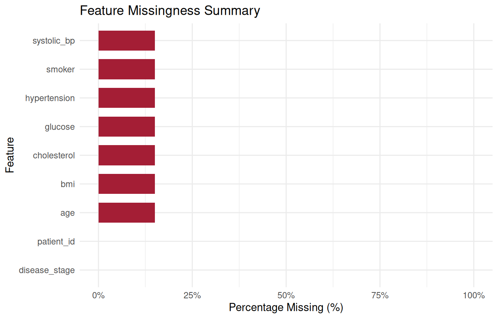
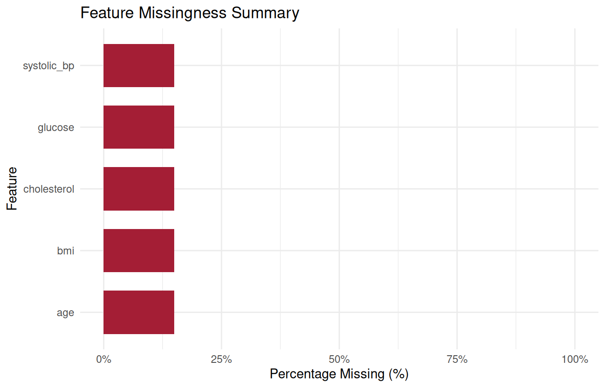
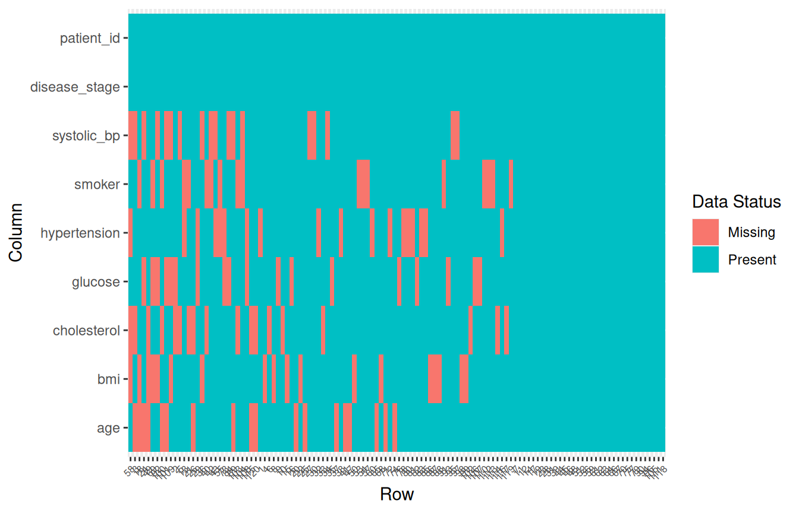
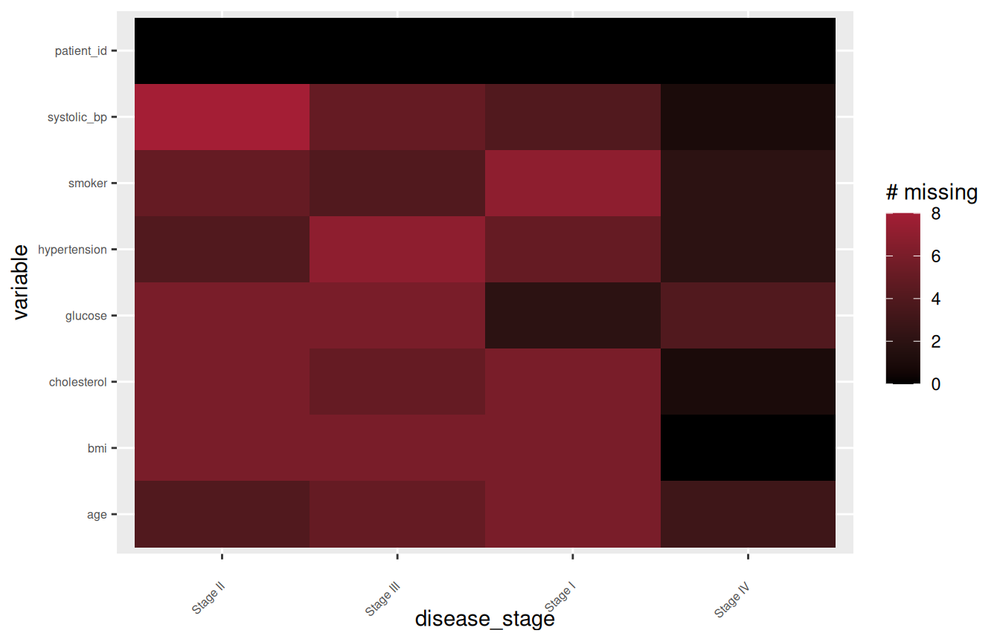
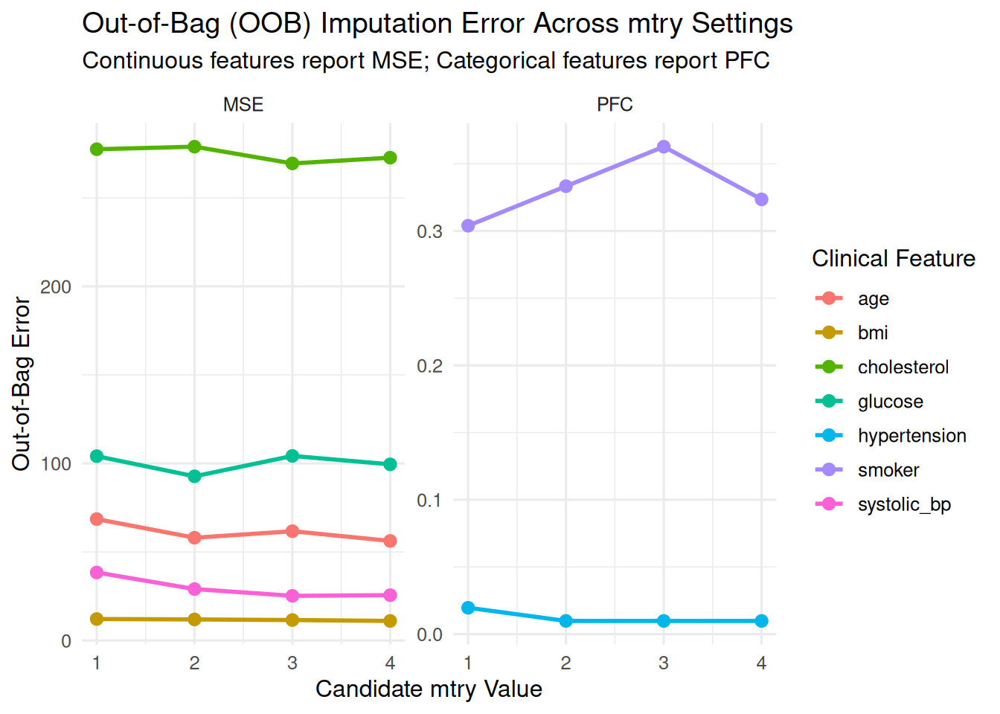
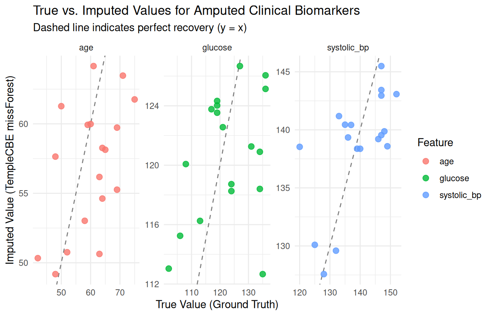

# 01. Exploratory Data Analysis, Missingness Auditing, and Normalization

## Overview

In clinical trials, electronic health records (EHR), and epidemiological
registries, data cleanliness is rarely a given. Datasets frequently
exhibit complex missingness patterns, non-standard missing codes
(e.g. `"999"`, `"-99"`, `"Unknown"`, `"Refused"`, `""`), and extreme
statistical outliers from data-entry errors or severe disease
phenotypes.

Standard data science tools often assume missingness is cleanly
represented as `NA`, requiring destructive multi-pass preprocessing
before exploratory analysis can even begin. The **`TempleCBE`** package
provides domain-tailored biostatistical tools to audit non-standard
missingness non-destructively, rank feature completeness, standardize
numerical features, classify clinical outliers under formal IQR
standards, and transition seamlessly into tuned machine-learning
imputation.

``` r

library(TempleCBE)
library(dplyr)
library(ggplot2)
```

------------------------------------------------------------------------

## Comparison with existing R EDA & missingness tools

The R ecosystem offers several packages for exploratory data analysis
and missingness visualization, notably
[naniar](https://naniar.njtierney.com/),
[visdat](https://docs.ropensci.org/visdat/),
[mice](https://amices.org/mice/), and general EDA toolkits like
`DataExplorer` and `summarytools`. Understanding where `TempleCBE` fits
alongside these frameworks clarifies its value for clinical
biostatisticians and data managers.

### Existing tools and their limitations in clinical workflows

- **`naniar` & `visdat`**: Pioneered tidy representation and
  visualization of missing data (`vis_miss()`, `gg_miss_var()`).
  However, they operate exclusively on existing `NA` values. When raw
  clinical data contains sentinel values (such as `"999"`, `"-99"`, or
  blank strings), users must first apply mutating functions like
  `replace_with_na_all()`, which can accidentally alter legitimate
  numerical values, modify factor levels, or mutate data types.
- **`mice` / `Amelia`**: Primarily multiple imputation engines. While
  they include basic diagnostics (e.g. `md.pattern()`), their tools are
  oriented toward parameter checking rather than automated feature-level
  reporting for regulatory deliverables.
- **Base R / `dplyr` summaries**: Simple calls like `colSums(is.na(df))`
  provide quick counts, but lack built-in percentage calculations,
  descending order sorting, sentinel code awareness, and
  publication-ready formatting.

### Where `TempleCBE` provides distinct value

`TempleCBE` was built specifically for the constraints of institutional
biostatistics core facilities:

1.  **Zero-mutation non-standard code auditing**:
    [`SumNa()`](https://jkylearmstrong.github.io/TempleCBE/reference/SumNa.md)
    and
    [`features_percent_miss()`](https://jkylearmstrong.github.io/TempleCBE/reference/features_percent_miss.md)
    natively accept vectors of custom missing codes
    (`na_list = c("999", "-99", "", "Unknown", "NA")`). They compute
    exact missingness counts and percentages *without altering or
    coercing the underlying data frame*.
2.  **Two-tier clinical outlier governance**: While generic outlier
    functions often rely on simple z-score cutoffs or arbitrary
    quantiles,
    [`detect_outliers()`](https://jkylearmstrong.github.io/TempleCBE/reference/detect_outliers.md)
    implements Tukey’s formal biostatistical standard, explicitly
    distinguishing between **MILD** ($`1.5 \times \text{IQR}`$) and
    **EXTREME** ($`3.0 \times \text{IQR}`$) outliers and returning
    structured classification flags that preserve patient keys.
3.  **Controlled imputation benchmarking**: The
    [`add_missing()`](https://jkylearmstrong.github.io/TempleCBE/reference/add_missing.md)
    function allows statisticians to simulate controlled Missing
    Completely at Random (MCAR) mechanisms on complete datasets,
    tracking the exact row-and-column coordinates of every amputed cell
    to empirically validate downstream imputation performance.
4.  **Seamless transition to tuned imputation**: `TempleCBE` links
    missingness auditing directly to high-performance imputation engines
    ([`missforest_sweep_mtry()`](https://jkylearmstrong.github.io/TempleCBE/reference/missforest_sweep_mtry.md)
    and
    [`missranger_sweep_mtry()`](https://jkylearmstrong.github.io/TempleCBE/reference/missranger_sweep_mtry.md))
    that automatically optimize random forest hyperparameters (`mtry`)
    independently for each clinical feature.

### Feature comparison matrix

| Dimension | Base / Tidyverse | `naniar` / `visdat` | `TempleCBE` |
|:---|:---|:---|:---|
| **Multi-code missingness** | Manual recoding required | Requires mutating `replace_with_na()` | Built-in via `na_list` argument (zero mutation) |
| **Feature-level ranking** | Multi-line [`summarise()`](https://dplyr.tidyverse.org/reference/summarise.html) | `miss_var_summary()` | [`features_percent_miss()`](https://jkylearmstrong.github.io/TempleCBE/reference/features_percent_miss.md) (sorted tibble + S3 plot) |
| **Missingness heatmap** | Not built-in | `vis_miss()` | [`missmap()`](https://jkylearmstrong.github.io/TempleCBE/reference/missmap.md) (custom clinical palette & grouping) |
| **Outlier classification** | Manual IQR calculations | Not covered | Two-tier Tukey standard (MILD: 1.5×, EXTREME: 3.0×) |
| **Feature normalization** | [`scale()`](https://rdrr.io/r/base/scale.html) (matrix output) | Not covered | [`min_max_norm()`](https://jkylearmstrong.github.io/TempleCBE/reference/min_max_norm.md), [`z_norm()`](https://jkylearmstrong.github.io/TempleCBE/reference/z_norm.md), [`range_norm()`](https://jkylearmstrong.github.io/TempleCBE/reference/range_norm.md) |
| **Controlled amputation** | External (`mice::ampute`) | Limited | [`add_missing()`](https://jkylearmstrong.github.io/TempleCBE/reference/add_missing.md) with tracked cell coordinates |
| **Imputation handoff** | External | External | Integrated [`missforest_sweep_mtry()`](https://jkylearmstrong.github.io/TempleCBE/reference/missforest_sweep_mtry.md) / [`missranger_sweep_mtry()`](https://jkylearmstrong.github.io/TempleCBE/reference/missranger_sweep_mtry.md) |

------------------------------------------------------------------------

## 1. Starting with a Full Synthetic Clinical Cohort

To demonstrate missingness auditing and empirically evaluate imputation
accuracy, we begin with a relatively full synthetic cohort of
$`N = 120`$ clinical patients. In real-world studies, true underlying
values are unknown once lost. By generating a complete cohort with
realistic physiological correlations first, we establish a verifiable
**ground truth** that enables downstream recovery benchmarking:

``` r

set.seed(2026)
n <- 120

# Realistic clinical covariance structure
age <- round(rnorm(n, mean = 58, sd = 9))
bmi <- round(rnorm(n, mean = 27.0, sd = 3.8), 1)
systolic_bp <- round(95 + 0.45 * age + 0.65 * bmi + rnorm(n, mean = 0, sd = 7))
cholesterol <- round(155 + 0.55 * age + 1.10 * bmi + rnorm(n, mean = 0, sd = 15))
glucose <- round(72 + 0.35 * age + 0.95 * bmi + rnorm(n, mean = 0, sd = 10))
smoker <- factor(sample(c("No", "Yes"), n, replace = TRUE, prob = c(0.65, 0.35)))
hypertension <- factor(ifelse(systolic_bp >= 135 | (age >= 62 & bmi >= 28), "Yes", "No"))
disease_stage <- factor(sample(c("Stage I", "Stage II", "Stage III", "Stage IV"), n,
  replace = TRUE, prob = c(0.30, 0.30, 0.25, 0.15)
))

cohort_clean <- tibble::tibble(
  patient_id    = sprintf("PT_%03d", seq_len(n)),
  age           = age,
  systolic_bp   = systolic_bp,
  bmi           = bmi,
  cholesterol   = cholesterol,
  glucose       = glucose,
  smoker        = smoker,
  hypertension  = hypertension,
  disease_stage = disease_stage
)

# Preview the clean cohort
head(cohort_clean, 6)
#> # A tibble: 6 × 9
#>   patient_id   age systolic_bp   bmi cholesterol glucose smoker hypertension
#>   <chr>      <dbl>       <dbl> <dbl>       <dbl>   <dbl> <fct>  <fct>       
#> 1 PT_001        63         147  34.2         244     133 Yes    Yes         
#> 2 PT_002        48         140  35.1         189     134 No     Yes         
#> 3 PT_003        59         148  27.9         187     117 No     Yes         
#> 4 PT_004        57         146  30.4         200     111 No     Yes         
#> 5 PT_005        52         132  20.4         222     128 No     No          
#> 6 PT_006        35         129  28.8         219     128 Yes    No          
#> # ℹ 1 more variable: disease_stage <fct>

# Verify complete data integrity (zero missingness)
SumNa(cohort_clean)
#> [1] 0
```

The dataset contains: - Continuous biomarkers: `age`, `systolic_bp`,
`bmi`, `cholesterol`, and `glucose`. - Categorical clinical factors:
`smoker`, `hypertension`, and `disease_stage`. - Unique identifier:
`patient_id`.

------------------------------------------------------------------------

## 2. Controlled Amputation with `add_missing()`

In validation studies, biostatisticians simulate controlled Missing
Completely at Random (MCAR) mechanisms using
[`add_missing()`](https://jkylearmstrong.github.io/TempleCBE/reference/add_missing.md).
This allows us to observe how data-auditing tools detect missingness and
how machine-learning algorithms reconstruct true values.

Here, we amputate **15% missingness** across 7 clinical predictors,
leaving `patient_id` and `disease_stage` 100% complete:

``` r

set.seed(42)
amputed <- add_missing(
  cohort_clean,
  cols = c(age, systolic_bp, bmi, cholesterol, glucose, smoker, hypertension),
  pct_na = 0.15
)

# Inspect the amputed cohort preview
head(amputed, 6)
#> # A tibble: 6 × 9
#>   patient_id   age systolic_bp   bmi cholesterol glucose smoker hypertension
#>   <chr>      <dbl>       <dbl> <dbl>       <dbl>   <dbl> <fct>  <fct>       
#> 1 PT_001        63         147  34.2         244     133 Yes    NA          
#> 2 PT_002        48         140  35.1          NA      NA No     Yes         
#> 3 PT_003        NA          NA  27.9          NA     117 No     Yes         
#> 4 PT_004        57         146  NA           200     111 No     Yes         
#> 5 PT_005        52          NA  20.4          NA     128 No     No          
#> 6 PT_006        35         129  28.8          NA     128 Yes    No          
#> # ℹ 1 more variable: disease_stage <fct>
```

### Tracking masked coordinates for ground-truth validation

A crucial feature of
[`add_missing()`](https://jkylearmstrong.github.io/TempleCBE/reference/add_missing.md)
is that it attaches an attribute named `"missing_cells"`. This attribute
stores a tibble of every masked cell’s exact `row` number and `feature`
name:

``` r

# Extract the ground-truth coordinate lookup table
missing_cells <- attr(amputed, "missing_cells")

cat("Total cells amputed:", nrow(missing_cells), "\n")
#> Total cells amputed: 126
head(missing_cells, 8)
#> # A tibble: 8 × 2
#>     row feature
#>   <int> <chr>  
#> 1     3 age    
#> 2    18 age    
#> 3    20 age    
#> 4    24 age    
#> 5    25 age    
#> 6    26 age    
#> 7    37 age    
#> 8    41 age
```

Because most `dplyr` verbs strip custom attributes upon transformation,
always extract `missing_cells <- attr(amputed, "missing_cells")`
immediately following amputation when benchmarking imputation pipelines.

### Heterogeneous missingness: Column-specific proportions via vector `pct_na`

In real-world clinical cohorts, different variables rarely share an
identical missingness rate. Routine clinical covariates (such as `age`
or `bmi`) may only be missing in 5–10% of records, whereas specialized
laboratory panels (such as `cholesterol` or `glucose`) may be
uncollected in 25–35% of patients.

[`add_missing()`](https://jkylearmstrong.github.io/TempleCBE/reference/add_missing.md)
supports a numeric vector for `pct_na` whose length matches the number
of selected columns:

``` r

# Generate column-specific missingness proportions with runif()
set.seed(42)
cols_ampute <- c("age", "systolic_bp", "bmi", "cholesterol", "glucose", "smoker", "hypertension")

p_vector <- cols_ampute |>
  length() |>
  runif(min = 0.05, max = 0.30) |>
  round(2)

names(p_vector) <- cols_ampute
p_vector
#>          age  systolic_bp          bmi  cholesterol      glucose       smoker 
#>         0.28         0.28         0.12         0.26         0.21         0.18 
#> hypertension 
#>         0.23

# Amputate each column according to its specific proportion
amputed_hetero <- add_missing(
  cohort_clean,
  cols = c(age, systolic_bp, bmi, cholesterol, glucose, smoker, hypertension),
  pct_na = p_vector
)

# Inspect how features_percent_miss captures the heterogeneous rates
features_percent_miss(amputed_hetero)
#> # A tibble: 9 × 5
#>   feature       SumNa SumComp PctNa PctComp
#>   <chr>         <int>   <int> <dbl>   <dbl>
#> 1 age              34      86 0.283   0.717
#> 2 systolic_bp      34      86 0.283   0.717
#> 3 cholesterol      31      89 0.258   0.742
#> 4 hypertension     28      92 0.233   0.767
#> 5 glucose          25      95 0.208   0.792
#> 6 smoker           22      98 0.183   0.817
#> 7 bmi              14     106 0.117   0.883
#> 8 patient_id        0     120 0       1    
#> 9 disease_stage     0     120 0       1
```

Notice how
[`features_percent_miss()`](https://jkylearmstrong.github.io/TempleCBE/reference/features_percent_miss.md)
directly reflects each column’s distinct amputation share, and the
`missing_cells` attribute accurately tracks the varying number of masked
cells per feature.

------------------------------------------------------------------------

## 3. Auditing Missing Data

Now that missingness has been induced, we audit the dataset using
`TempleCBE`’s non-destructive auditing suite.

### Total missingness with `SumNa()`

[`SumNa()`](https://jkylearmstrong.github.io/TempleCBE/reference/SumNa.md)
evaluates total missing cells across an entire vector, data frame, or
matrix. When working with raw hospital extracts containing non-standard
placeholders, specify custom sentinel codes in `na_list`:

``` r

# Total missing cells in our amputed cohort (18 rows * 7 features = 126 cells)
SumNa(amputed)
#> [1] 126

# Demonstrating multi-sentinel code auditing without modifying data types
vec_raw <- c(12, 14, NA, 999, 18, "", "Unknown", -99)
SumNa(vec_raw, na_list = c("999", "-99", "", "Unknown"))
#> [1] 5
```

### Feature-level completeness table with `features_percent_miss()`

In clinical study preparation, biostatisticians need a sorted summary
showing which variables exceed missingness thresholds (e.g. variables
with $`>20\%`$ missingness that cannot be reliably imputed):

``` r

miss_summary <- features_percent_miss(amputed)
miss_summary
#> # A tibble: 9 × 5
#>   feature       SumNa SumComp PctNa PctComp
#>   <chr>         <int>   <int> <dbl>   <dbl>
#> 1 age              18     102  0.15    0.85
#> 2 systolic_bp      18     102  0.15    0.85
#> 3 bmi              18     102  0.15    0.85
#> 4 cholesterol      18     102  0.15    0.85
#> 5 glucose          18     102  0.15    0.85
#> 6 smoker           18     102  0.15    0.85
#> 7 hypertension     18     102  0.15    0.85
#> 8 patient_id        0     120  0       1   
#> 9 disease_stage     0     120  0       1
```

Notice that: - All 7 amputed features exhibit exactly `PctNa = 0.15` (18
missing cells out of 120 rows). - The un-amputed columns (`patient_id`
and `disease_stage`) correctly report `PctNa = 0.00`. - The output is
automatically sorted in descending order of missingness proportion.

### Visualizing missingness with `plot_features_percent_miss()`

[`plot_features_percent_miss()`](https://jkylearmstrong.github.io/TempleCBE/reference/plot_features_percent_miss.md)
(or calling [`plot()`](https://rdrr.io/r/graphics/plot.default.html) on
a `features_percent_miss` object) produces a clean horizontal bar chart
displaying feature-level missingness:

``` r

plot_features_percent_miss(amputed)
```



We can also isolate the top features or enforce custom thresholds:

``` r

plot_features_percent_miss(amputed, top_n = 5)
```



### Missingness heatmaps with `missmap()`

The
[`missmap()`](https://jkylearmstrong.github.io/TempleCBE/reference/missmap.md)
function visualizes missingness patterns across the cohort.

#### 1. Patient-level heatmap (`row_order = FALSE`)

Visualizes every patient row and feature column. Rows and columns are
sorted by missingness density, allowing visual identification of
patients with clustered missing labs:

``` r

missmap(amputed)
```



#### 2. Group-aggregated heatmap (`by_column = ...`)

In clinical trials, auditing missingness aggregated by study arm,
hospital site, or disease stage is critical for trial monitoring:

``` r

# Aggregate missingness counts per disease stage
missmap(amputed, by_column = disease_stage, fill = "count")
```



------------------------------------------------------------------------

## 4. Clinical Outlier Governance and Feature Normalization

Before proceeding to imputation, exploratory clinical workflows require
screening for distributional anomalies and scaling features.

### Two-tier Tukey outlier detection

[`detect_outliers()`](https://jkylearmstrong.github.io/TempleCBE/reference/detect_outliers.md)
audits numerical features using Tukey’s formal IQR criteria: - **Mild
Outliers**: Values lying outside
$`[Q_1 - 1.5 \times \text{IQR}, Q_3 + 1.5 \times \text{IQR}]`$. -
**Extreme Outliers**: Values lying outside
$`[Q_1 - 3.0 \times \text{IQR}, Q_3 + 3.0 \times \text{IQR}]`$.

``` r

# Screen cholesterol for mild and extreme clinical anomalies
outlier_chol <- detect_outliers(cohort_clean$cholesterol)
outlier_chol
#> # A tibble: 1 × 4
#>   column value .outlier .outlier_type
#>   <chr>  <dbl> <fct>    <fct>        
#> 1 value    274 TRUE     MILD
```

### Distributional testing

Before applying parametric survival or regression models, test
distributional assumptions with
[`distribution_test()`](https://jkylearmstrong.github.io/TempleCBE/reference/distribution_test.md):

``` r

distribution_test(cohort_clean$glucose)
#> # A tibble: 3 × 8
#>   statistic parameter p.value method  distribution.test p_value_sig distribution
#>       <dbl>     <int>   <dbl> <chr>   <lgl>             <chr>       <chr>       
#> 1   12.6            8   0.125 Chi-sq… TRUE              ""          poisson     
#> 2    0.994         NA   0.883 Shapir… TRUE              ""          normal      
#> 3    0.0721        NA   0.131 Lillie… TRUE              ""          normal      
#> # ℹ 1 more variable: is_int <lgl>
```

### Feature normalization

`TempleCBE` provides three standard vector transformations for preparing
predictors for penalized regressions or distance-based algorithms: -
[`min_max_norm()`](https://jkylearmstrong.github.io/TempleCBE/reference/min_max_norm.md):
Scales values strictly to $`[0, 1]`$. -
[`z_norm()`](https://jkylearmstrong.github.io/TempleCBE/reference/z_norm.md):
Centers to mean $`\mu = 0`$ and scales to $`\sigma = 1`$. -
[`range_norm()`](https://jkylearmstrong.github.io/TempleCBE/reference/range_norm.md):
Scales relative to combined distribution bounds.

``` r

# Sample values from baseline systolic blood pressure
bp_sample <- cohort_clean$systolic_bp[1:5]

tibble::tibble(
  raw     = bp_sample,
  min_max = round(min_max_norm(bp_sample), 3),
  z_score = round(z_norm(bp_sample), 3)
)
#> # A tibble: 5 × 3
#>     raw min_max z_score
#>   <dbl>   <dbl>   <dbl>
#> 1   147   0.938   0.657
#> 2   140   0.5    -0.388
#> 3   148   1       0.807
#> 4   146   0.875   0.508
#> 5   132   0      -1.58
```

### Pairwise correlation screening with `corr_test_all()`

Screening for multicollinearity across clinical biomarkers helps
identify redundant covariates before regression modeling and confirms
the underlying covariance that imputation engines exploit:

``` r

# Pairwise correlation across continuous clinical biomarkers
corr_tbl <- corr_test_all(
  cohort_clean[, c("age", "systolic_bp", "bmi", "cholesterol", "glucose")]
)
head(corr_tbl, 6)
#> # A tibble: 6 × 4
#>   var1        var2            r  p_value
#>   <chr>       <chr>       <dbl>    <dbl>
#> 1 age         systolic_bp 0.524 8.21e-10
#> 2 systolic_bp bmi         0.379 1.92e- 5
#> 3 bmi         glucose     0.292 1.19e- 3
#> 4 cholesterol glucose     0.286 1.54e- 3
#> 5 age         glucose     0.257 4.62e- 3
#> 6 systolic_bp cholesterol 0.244 7.29e- 3
```

------------------------------------------------------------------------

## 5. Tuned Random Forest Imputation with `missforest_sweep_mtry()`

Once missingness patterns and outliers have been audited,
biostatisticians must handle missing values. Random forest imputation is
widely considered the gold standard for mixed clinical data because it
captures non-linear physiological relationships and complex interactions
without requiring parametric distribution assumptions.

### The `mtry` dilemma in clinical data

Random forest imputation iterates through each variable with missing
values, fitting a forest predicting that variable from all other
variables. The single most impactful hyperparameter is **`mtry`** — the
number of candidate variables sampled at each split: - If `mtry` is too
low, strong predictive biomarkers may be missed at key splits. - If
`mtry` is too high, trees become correlated and overfit noisy clinical
features.

Critically, **different clinical variables perform best at different
`mtry` values**. A continuous biomarker (e.g. `systolic_bp`) may achieve
minimal error at $`mtry = 3`$, whereas a binary factor (e.g. `smoker`)
may perform best at $`mtry = 1`$. Standard implementations force
analysts to choose a single global `mtry`.

### `TempleCBE`’s solution: Independent per-column best `mtry` assembly

[`missforest_sweep_mtry()`](https://jkylearmstrong.github.io/TempleCBE/reference/missforest_sweep_mtry.md)
sweeps across candidate `mtry` values, tracks out-of-bag (OOB) error for
every column at every `mtry`, and pulls each column independently from
the specific run where that column achieved its minimal error.

``` r

# Run missForest sweep across mtry = 1:4
# We exclude patient_id and disease_stage from imputation predictors
res_forest <- missforest_sweep_mtry(
  data            = amputed,
  exclude         = c("patient_id", "disease_stage"),
  mtry_values     = 1:4,
  ntree           = 60,
  maxiter         = 5,
  parallel        = FALSE,
  seed            = 123
)
```

### Inspecting the winning `mtry` per feature

``` r

# Winning mtry and minimum OOB error per column
res_forest$best
#> # A tibble: 7 × 4
#>   column       error_type     error  mtry
#>   <chr>        <chr>          <dbl> <int>
#> 1 smoker       PFC          0.304       1
#> 2 glucose      MSE         92.7         2
#> 3 hypertension PFC          0.00980     2
#> 4 systolic_bp  MSE         25.2         3
#> 5 cholesterol  MSE        269.          3
#> 6 age          MSE         56.2         4
#> 7 bmi          MSE         11.1         4
```

Notice that: - Features optimize at **different** `mtry` values
(e.g. `smoker` at $`mtry = 1`$, `hypertension` and `glucose` at
$`mtry = 2`$, `systolic_bp` and `cholesterol` at $`mtry = 3`$, `age` and
`bmi` at $`mtry = 4`$). - Categorical features report Proportion of
Falsely Classified (**PFC**), while continuous features report Mean
Squared Error (**MSE**). - `imp_data` contains the completed cohort with
`patient_id` and `disease_stage` re-attached in place:

``` r

head(res_forest$imp_data, 6)
#> # A tibble: 6 × 9
#>   patient_id   age systolic_bp   bmi cholesterol glucose smoker hypertension
#>   <chr>      <dbl>       <dbl> <dbl>       <dbl>   <dbl> <fct>  <fct>       
#> 1 PT_001      63          147   34.2        244     133  Yes    Yes         
#> 2 PT_002      48          140   35.1        223.    118. No     Yes         
#> 3 PT_003      59.9        140.  27.9        222.    117  No     Yes         
#> 4 PT_004      57          146   26.4        200     111  No     Yes         
#> 5 PT_005      52          130.  20.4        214.    128  No     No          
#> 6 PT_006      35          129   28.8        213.    128  Yes    No          
#> # ℹ 1 more variable: disease_stage <fct>

# Verify that all missing values have been successfully resolved
SumNa(res_forest$imp_data)
#> [1] 0
```

------------------------------------------------------------------------

## 6. Comparing Differences in Errors

A rigorous validation workflow evaluates errors along two dimensions: 1.
**Model-reported Out-of-Bag (OOB) errors** across candidate `mtry`
values. 2. **Empirical recovery errors** comparing imputed values
directly against the known ground truth.

### Comparison 1: Differences in OOB errors across `mtry` values

We first examine how out-of-bag error varies across the swept `mtry`
values for each feature:

``` r

# Tidy OOB error across all mtry values
res_forest$oob_error |>
  dplyr::arrange(column, mtry)
#> # A tibble: 28 × 4
#>    column      error_type error  mtry
#>    <chr>       <chr>      <dbl> <int>
#>  1 age         MSE         68.6     1
#>  2 age         MSE         58.0     2
#>  3 age         MSE         61.7     3
#>  4 age         MSE         56.2     4
#>  5 bmi         MSE         12.1     1
#>  6 bmi         MSE         11.9     2
#>  7 bmi         MSE         11.5     3
#>  8 bmi         MSE         11.1     4
#>  9 cholesterol MSE        277.      1
#> 10 cholesterol MSE        279.      2
#> # ℹ 18 more rows
```

We can visualize this trajectory to see why variable-wise selection
outperforms a single global `mtry`:

``` r

res_forest$oob_error |>
  ggplot(aes(x = mtry, y = error, color = column, group = column)) +
  geom_line(linewidth = 1) +
  geom_point(size = 2.5) +
  facet_wrap(~error_type, scales = "free_y") +
  theme_minimal(base_size = 12) +
  labs(
    title = "Out-of-Bag (OOB) Imputation Error Across mtry Settings",
    subtitle = "Continuous features report MSE; Categorical features report PFC",
    x = "Candidate mtry Value",
    y = "Out-of-Bag Error",
    color = "Clinical Feature"
  ) +
  scale_x_continuous(breaks = 1:4)
```



Notice the key biostatistical insights: - If a global setting of
$`mtry = 1`$ had been enforced, continuous features like `systolic_bp`
and `cholesterol` would suffer significantly elevated MSE. - If a global
setting of $`mtry = 4`$ had been enforced, binary features like `smoker`
and `hypertension` would suffer increased misclassification. -
`TempleCBE`’s independent column assembly selects the global minimum for
every variable simultaneously.

### Comparison 2: Imputation Recovery vs. Known Ground Truth

Because we started with a complete dataset (`cohort_clean`) and used
[`add_missing()`](https://jkylearmstrong.github.io/TempleCBE/reference/add_missing.md)
to induce missingness, we can cross-reference every imputed cell with
its original, unmasked ground truth:

``` r

# Match imputed cells to true values via missing_cells coordinates
truth_vs_imp <- missing_cells |>
  dplyr::rowwise() |>
  dplyr::mutate(
    true_val    = as.character(cohort_clean[[feature]][row]),
    imputed_val = as.character(res_forest$imp_data[[feature]][row])
  ) |>
  dplyr::ungroup()

# Sample of ground truth vs imputed predictions
head(truth_vs_imp, 10)
#> # A tibble: 10 × 4
#>      row feature true_val imputed_val     
#>    <int> <chr>   <chr>    <chr>           
#>  1     3 age     59       59.9303571428572
#>  2    18 age     60       59.9879443241943
#>  3    20 age     64       54.6236375661376
#>  4    24 age     71       63.4742791005291
#>  5    25 age     58       53.0240145502645
#>  6    26 age     75       61.758664021164 
#>  7    37 age     63       56.1781216931217
#>  8    41 age     48       57.6436417748918
#>  9    47 age     64       58.2681746031746
#> 10    49 age     65       58.1386375661376
```

#### Continuous feature recovery metrics

For continuous biomarkers, we quantify recovery fidelity using: - **Mean
Absolute Error (MAE)**: Average magnitude of prediction errors. - **Root
Mean Squared Error (RMSE)**: Penalizes larger deviations. - **Pearson
Correlation ($`r`$)**: Measures linear agreement between true and
recovered values.

``` r

cont_features <- c("age", "systolic_bp", "bmi", "cholesterol", "glucose")

cont_metrics <- truth_vs_imp |>
  dplyr::filter(feature %in% cont_features) |>
  dplyr::mutate(
    true_num = as.numeric(true_val),
    imp_num  = as.numeric(imputed_val),
    diff     = imp_num - true_num
  ) |>
  dplyr::group_by(feature) |>
  dplyr::summarise(
    n_masked  = dplyr::n(),
    MAE       = round(mean(abs(diff)), 2),
    RMSE      = round(sqrt(mean(diff^2)), 2),
    Corr      = round(cor(imp_num, true_num), 3),
    .groups   = "drop"
  )

cont_metrics
#> # A tibble: 5 × 5
#>   feature     n_masked   MAE  RMSE  Corr
#>   <chr>          <int> <dbl> <dbl> <dbl>
#> 1 age               18  6.98  8.17 0.5  
#> 2 bmi               18  2.04  2.67 0.208
#> 3 cholesterol       18 17.0  22.4  0.207
#> 4 glucose           18  8.43  9.92 0.353
#> 5 systolic_bp       18  5.55  7.01 0.636
```

#### Categorical feature recovery metrics

For binary clinical factors, we evaluate classification accuracy and
misclassification rate:

``` r

cat_features <- c("smoker", "hypertension")

cat_metrics <- truth_vs_imp |>
  dplyr::filter(feature %in% cat_features) |>
  dplyr::group_by(feature) |>
  dplyr::summarise(
    n_masked      = dplyr::n(),
    accuracy      = round(mean(true_val == imputed_val), 3),
    mismatch_rate = round(mean(true_val != imputed_val), 3),
    .groups       = "drop"
  )

cat_metrics
#> # A tibble: 2 × 4
#>   feature      n_masked accuracy mismatch_rate
#>   <chr>           <int>    <dbl>         <dbl>
#> 1 hypertension       18    0.944         0.056
#> 2 smoker             18    0.611         0.389
```

### Visualizing recovery fidelity

We can visually evaluate recovery by plotting true values versus imputed
values for continuous predictors:

``` r

truth_vs_imp |>
  dplyr::filter(feature %in% c("systolic_bp", "age", "glucose")) |>
  dplyr::mutate(
    true_num = as.numeric(true_val),
    imp_num  = as.numeric(imputed_val)
  ) |>
  ggplot(aes(x = true_num, y = imp_num, color = feature)) +
  geom_abline(slope = 1, intercept = 0, linetype = "dashed", color = "grey50") +
  geom_point(size = 2.5, alpha = 0.8) +
  facet_wrap(~feature, scales = "free") +
  theme_minimal(base_size = 11) +
  labs(
    title = "True vs. Imputed Values for Amputed Clinical Biomarkers",
    subtitle = "Dashed line indicates perfect recovery (y = x)",
    x = "True Value (Ground Truth)",
    y = "Imputed Value (TempleCBE missForest)",
    color = "Feature"
  )
```



The recovery results confirm that: - Strongly correlated features like
`systolic_bp` and `hypertension` achieve high recovery precision
(correlation $`r > 0.63`$ and classification accuracy $`> 94\%`$). -
Out-of-bag error tracks closely with true empirical recovery error,
confirming that optimizing `mtry` per feature leads to tangible gains in
reconstructing real patient data.

------------------------------------------------------------------------

## 7. Fast, Large-Scale Imputation with `missranger_sweep_mtry()`

For large clinical cohorts (e.g. $`> 10,000`$ patients or
high-dimensional panels), `missForest` can be computationally intensive.
[`missranger_sweep_mtry()`](https://jkylearmstrong.github.io/TempleCBE/reference/missranger_sweep_mtry.md)
leverages the C++ `ranger` engine and supports Predictive Mean Matching
(PMM):

- **Predictive Mean Matching (`pmm.k`)**: Setting `pmm.k > 0`
  (e.g. `pmm.k = 3`) ensures that imputed values are drawn from actual
  observed patient donor values rather than synthetic regression
  averages — critical for bounded clinical scores (e.g. integer counts,
  survey scores).
- **Parallel evaluation**: Uses `furrr` to evaluate candidate `mtry`
  values across CPU cores in parallel without thread oversubscription.

``` r

library(furrr)
plan(multisession, workers = 2)

# Fast sweep with predictive mean matching
res_ranger <- missranger_sweep_mtry(
  data        = amputed,
  exclude     = c("patient_id", "disease_stage"),
  mtry_values = 1:4,
  num.trees   = 200,
  pmm.k       = 3,
  seed        = 2026,
  parallel    = TRUE
)

# Inspect winning mtry values from ranger
res_ranger$best
```

### Safety and data governance guardrails

Both sweep functions incorporate essential clinical data safeguards: 1.
**Identifier and timestamp protection (`exclude`)**: Clinical metadata
(patient IDs, specimen barcodes, visit dates) are quarantined from the
forest training matrix and re-attached unaltered to the final output. 2.
**Preventing data fabrication (`max_pct_missing`)**: Features that are
$`>50\%`$ missing (or any custom threshold) are automatically held out
from imputation, carried through unimputed, and listed in
`excluded_high_missing`. 3. **Refusing all-`NA` columns
(`check_no_all_na_columns`)**: Standard `missForest` silently drops
all-`NA` columns, while `missRanger` silently returns them still `NA`.
`TempleCBE` explicitly halts and warns the user so schema integrity is
never compromised.

------------------------------------------------------------------------

## 8. Practical Adoption Patterns

Here are three common patterns for applying `TempleCBE`’s EDA tools to
real-world studies:

### Pattern 1: Clinical trial data intake audit

Create a standardized data quality intake report for newly exported
registry data:

``` r

audit_clinical_intake <- function(raw_df) {
  message("Auditing Clinical Intake...")

  # 1. Quantify missingness including institutional sentinel values
  miss_summary <- features_percent_miss(
    raw_df,
    na_list = c("999", "-99", "Unknown", "Refused", "")
  )

  # 2. Flag variables with severe missingness (> 30%)
  flagged_vars <- miss_summary |>
    filter(PctNa > 0.30)

  # 3. Screen continuous lab values for extreme clinical outliers
  num_cols <- raw_df |> select(where(is.numeric))
  outliers <- lapply(num_cols, detect_outliers)

  list(
    missing_summary = miss_summary,
    severe_missing  = flagged_vars,
    outliers        = outliers
  )
}
```

### Pattern 2: Regulatory missingness tables for Study Protocols & CSRs

Clinical Study Reports (CSRs) submitted to regulatory agencies (FDA,
EMA) require clear tables of missing baseline covariates:

``` r

# Export publication-ready missingness tables
csr_missing_table <- features_percent_miss(amputed) |>
  rename(
    `Clinical Variable` = feature,
    `Missing Count (n)` = SumNa,
    `Missing Rate (%)`  = PctNa
  ) |>
  mutate(`Missing Rate (%)` = sprintf("%.1f%%", `Missing Rate (%)` * 100))

# Print or write to Excel/RTF
writexl::write_xlsx(csr_missing_table, "CSR_Table_14_1_Missingness.xlsx")
```

### Pattern 3: Outlier screening preserving subject record keys

Flag outliers while maintaining patient identifiers for case review with
clinical investigators:

``` r

# Screen lab values and join back to patient IDs
iqr_audit <- detect_outliers(cohort_clean$cholesterol)

flagged_patients <- cohort_clean |>
  slice(c(iqr_audit$mild_indices, iqr_audit$extreme_indices)) |>
  select(patient_id, disease_stage, cholesterol) |>
  mutate(
    flag = ifelse(patient_id %in% cohort_clean$patient_id[iqr_audit$extreme_indices],
      "EXTREME_OUTLIER", "MILD_OUTLIER"
    )
  )
```

------------------------------------------------------------------------

## Summary

`TempleCBE` delivers a clean, auditable, and non-destructive exploratory
workflow engineered specifically for the realities of clinical data. By
combining
[`SumNa()`](https://jkylearmstrong.github.io/TempleCBE/reference/SumNa.md),
[`features_percent_miss()`](https://jkylearmstrong.github.io/TempleCBE/reference/features_percent_miss.md),
[`missmap()`](https://jkylearmstrong.github.io/TempleCBE/reference/missmap.md),
[`detect_outliers()`](https://jkylearmstrong.github.io/TempleCBE/reference/detect_outliers.md),
and
[`add_missing()`](https://jkylearmstrong.github.io/TempleCBE/reference/add_missing.md)
with downstream tuned imputation
([`missforest_sweep_mtry()`](https://jkylearmstrong.github.io/TempleCBE/reference/missforest_sweep_mtry.md)
and
[`missranger_sweep_mtry()`](https://jkylearmstrong.github.io/TempleCBE/reference/missranger_sweep_mtry.md)),
biostatisticians can uphold rigorous data governance standards from
initial data intake through regulatory delivery.
