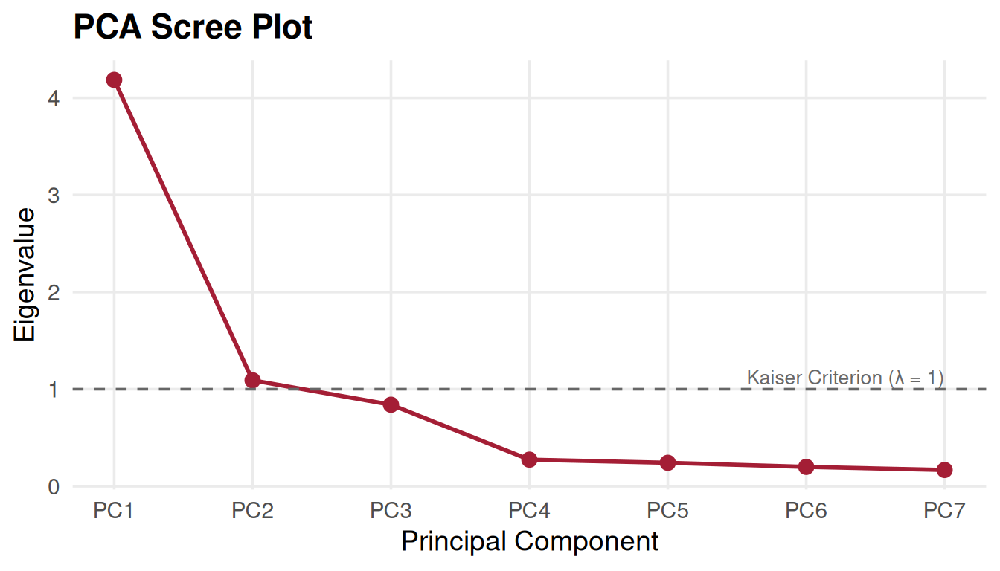
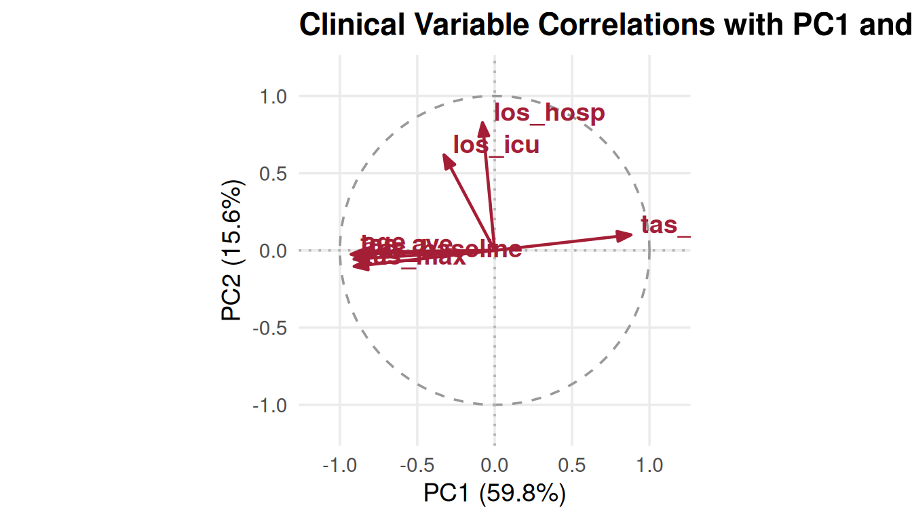

# 07. Principal Component Analysis in R and SAS

> **Author**: Darina Chudnovskaya (`darina.c@temple.edu`,
> `tub51812@temple.edu`)  
> **Reviewers**: `@tub51812@temple.edu`, J. Kyle Armstrong
> (`tus75918@temple.edu`, `@jkylearmstrong-temple`)  
> **Affiliation**: Lewis Katz School of Medicine at Temple University,
> Center for Biostatistics & Epidemiology

## Introduction: Dimension Reduction in Clinical and Exploratory Data Analysis

Principal Component Analysis (PCA) is an unsupervised machine learning
and exploratory data analysis (EDA) technique widely utilized across
biostatistics, clinical trials, and epidemiological research. When
analyzing large cohorts with extensive clinical measurements—such as
repeated physiological scores, biomarker panels, and intensive care
metrics—investigators often face high dimensionality and severe
multicollinearity.

As summarized by biostatistician Darina Chudnovskaya:

> *“To put all this simply, just think of principal components as new
> axes that provide the best angle to see and evaluate the data, so that
> the differences between the observations are better visible.”*
>
> — *Darina Chudnovskaya (citing builtin.com)*

PCA reduces the dimensionality of multivariate continuous datasets by
transforming correlated variables into a smaller set of uncorrelated,
orthogonal variables known as **Principal Components (PCs)**. Each
principal component is a linear combination of the original variables,
structured such that: 1. The **first principal component ($`PC_1`$)**
captures the maximum possible variance in the data. 2. Each subsequent
component ($`PC_2, PC_3, \dots`$) captures the maximum possible
remaining variance under the mathematical constraint that it is
orthogonal (uncorrelated) to all preceding components. 3. The total
variance across all principal components equals the total variance of
the original variables.

While principal components themselves are linear combinations and may
not have a single physical unit of measurement, analyzing their
**loadings** (eigenvectors) and **eigenvalues** reveals underlying data
structures, detects clustering, and helps researchers select
representative covariates for downstream multivariable survival modeling
(such as
[`cbe_cox_multi()`](https://jkylearmstrong.github.io/TempleCBE/reference/cbe_cox_multi.md)).

------------------------------------------------------------------------

## The 5-Step PCA Mathematical Workflow

The mathematical execution of PCA proceeds through five fundamental
steps:

      ┌─────────────────────────────────────────────────────────────┐
      │ 1. Standardize Continuous Variables (z-score scaling)       │
      └──────────────────────────────┬──────────────────────────────┘
                                     ▼
      ┌─────────────────────────────────────────────────────────────┐
      │ 2. Compute Covariance / Correlation Matrix (Σ or R)         │
      └──────────────────────────────┬──────────────────────────────┘
                                     ▼
      ┌─────────────────────────────────────────────────────────────┐
      │ 3. Compute Eigenvalues & Eigenvectors (Σ v = λ v)           │
      └──────────────────────────────┬──────────────────────────────┘
                                     ▼
      ┌─────────────────────────────────────────────────────────────┐
      │ 4. Retain Significant PCs (Kaiser Criterion & Scree Plot)   │
      └──────────────────────────────┬──────────────────────────────┘
                                     ▼
      ┌─────────────────────────────────────────────────────────────┐
      │ 5. Project Data onto Principal Axes (Feature Matrix X V)    │
      └─────────────────────────────────────────────────────────────┘

1.  **Standardize Variables**: Because PCA is sensitive to measurement
    scales (variables with larger numerical ranges would spuriously
    dominate the variance), features are centered to mean zero
    ($`\mu = 0`$) and scaled to unit variance ($`\sigma = 1`$):
    ``` math
    z_{ij} = \frac{x_{ij} - \bar{x}_j}{s_j}
    ```
    Standardizing is mathematically equivalent to performing PCA on the
    correlation matrix $`\mathbf{R}`$ rather than the unscaled
    covariance matrix $`\mathbf{\Sigma}`$.

2.  **Calculate Correlation / Covariance Matrix**: A symmetric
    $`p \times p`$ correlation matrix $`\mathbf{R}`$ is computed,
    capturing all pairwise linear relationships and correlation
    directions ($`+1`$ to $`-1`$).

3.  **Calculate Eigenvalues and Eigenvectors**: Eigen-decomposition
    solves the characteristic equation:
    ``` math
    \det(\mathbf{R} - \lambda \mathbf{I}) = 0 \quad \implies \quad \mathbf{R} \mathbf{v}_k = \lambda_k \mathbf{v}_k
    ```

    - **Eigenvalues ($`\lambda_k`$)**: Represent the variance explained
      by the $`k`$-th principal component. In standardized PCA with
      $`p`$ variables, $`\sum_{k=1}^p \lambda_k = p`$.
    - **Eigenvectors ($`\mathbf{v}_k`$)**: Unit-length directional
      vectors defining the principal axes (loadings).

4.  **Select Principal Components**:

    - **Kaiser-Guttman Criterion**: Retain components with eigenvalues
      $`\lambda_k \ge 1`$ (explaining more variance than an individual
      original standardized variable).
    - **Scree Plot Elbow**: Identify the inflection point where
      additional components yield diminishing marginal variance.
    - **Cumulative Variance Threshold**: Retain enough components to
      explain a pre-specified proportion of variance (typically
      70%–80%).

5.  **Recast Observations onto Principal Component Axes**: Observations
    are projected onto the retained eigenvectors to generate principal
    component scores:
    ``` math
    \mathbf{Y} = \mathbf{Z} \mathbf{V}_k
    ```

------------------------------------------------------------------------

## SAS and R Equivalence: The Iris Benchmark

To validate numerical equivalence between SAS `PROC PRINCOMP` and
[`TempleCBE::proc_pca()`](https://jkylearmstrong.github.io/TempleCBE/reference/proc_pca.md),
we evaluate Fisher’s Iris dataset (150 observations across 4
morphometric variables: `Sepal.Length`, `Sepal.Width`, `Petal.Length`,
`Petal.Width`).

### SAS PROC PRINCOMP Implementation

In SAS, principal component analysis on standardized variables is
invoked using `PROC PRINCOMP`:

``` sas
/* SAS PROC PRINCOMP Benchmark */
proc princomp data=sashelp.iris out=iris_pca plots=all;
   var SepalLength SepalWidth PetalLength PetalWidth;
run;
```

### TempleCBE proc_pca Implementation

In R using `TempleCBE`, the equivalent workflow is executed via
[`proc_pca()`](https://jkylearmstrong.github.io/TempleCBE/reference/proc_pca.md):

``` r

# Execute standardized PCA with TempleCBE
iris_pca <- proc_pca(iris, scale = TRUE)
iris_pca
#> # A tibble: 4 × 6
#>   component eigenvalue difference proportion variance_pct cum_variance_pct
#>   <chr>          <dbl>      <dbl>      <dbl>        <dbl>            <dbl>
#> 1 PC1           2.92        2.00     0.730         73.0               73.0
#> 2 PC2           0.914       0.767    0.229         22.9               95.8
#> 3 PC3           0.147       0.126    0.0367         3.67              99.5
#> 4 PC4           0.0207     NA        0.00518        0.518            100
```

### Numerical Concordance: SAS vs. TempleCBE

[`TempleCBE::proc_pca()`](https://jkylearmstrong.github.io/TempleCBE/reference/proc_pca.md)
mirrors the exact output table produced by SAS `PROC PRINCOMP`:

| Principal Component | Eigenvalue ($`\lambda`$) | Difference | Proportion of Variance | Cumulative Variance |
|:---|:--:|:--:|:--:|:--:|
| **PC1** | **2.9185** | 2.0045 | 72.96% | 72.96% |
| **PC2** | **0.9140** | 0.7673 | 22.85% | 95.81% |
| **PC3** | **0.1468** | 0.1261 | 3.67% | 99.48% |
| **PC4** | **0.0207** | — | 0.52% | 100.00% |

Notice that the first two principal components capture **95.81%** of the
total variance in the Iris dataset, allowing a 4-dimensional feature
space to be represented in two dimensions with negligible loss of
information.

------------------------------------------------------------------------

## Visualizing PCA: Scree Plots, Biplots, and Correlation Circles

`TempleCBE` provides comprehensive visualization functions adhering to
institutional design standards.

### 1. Scree Plot with Kaiser-Guttman Threshold

The scree plot displays eigenvalues across components, highlighting the
$`\lambda = 1`$ Kaiser criterion:

``` r

pca_scree_plot(iris_pca, metric = "eigenvalue", kaiser = TRUE)
```


Scree plot with Kaiser criterion threshold.

Only $`PC_1`$ exceeds the Kaiser threshold ($`\lambda_1 = 2.92 > 1.0`$),
while $`PC_2`$ ($`\lambda_2 = 0.91`$) is near the threshold and brings
cumulative explained variance to 95.8%.

### 2. Variable Correlation Circle

The correlation circle illustrates how each original variable correlates
with $`PC_1`$ and $`PC_2`$ on the unit circle:

``` r

pca_variables_plot(iris_pca, x = 1, y = 2)
```


Variable correlation circle on the unit circle.

**Interpretation**: - `Petal.Length`, `Petal.Width`, and `Sepal.Length`
exhibit strong positive correlations with $`PC_1`$ (vectors extending to
the right). - `Sepal.Width` is nearly orthogonal to the petal dimensions
and projects predominantly along $`PC_2`$ (vector extending upward).

### 3. Loadings Biplot with 95% Concentration Ellipses

The biplot projects individual observations along with variable loading
vectors, with optional grouping and 95% confidence/concentration
ellipses:

``` r

pca_biplot(iris_pca, group = iris$Species, ellipse = TRUE, percent = TRUE, title = "Iris PCA Biplot with 95% Concentration Ellipses")
```


PCA biplot showing observation scores, variable vectors, and species
clusters.

The biplot demonstrates complete separation of *Iris setosa* along
$`PC_1`$, driven by smaller petal dimensions and broader sepal width.

------------------------------------------------------------------------

## Clinical Application: Dimensionality Reduction for Survival Analysis

In clinical observational studies, researchers frequently collect
multiple correlated physiological and procedural measurements. For
example, consider an ICU cohort with 165 patients tracking: -
**Temperature Alteration Scores (TAS)**: `tas_baseline`, `tas_min`,
`tas_max`, `tas_ave` - **Demographics**: `age` - **Hospital Course**:
`los_icu` (ICU length of stay), `los_hosp` (hospital length of stay)

### Simulating a Clinical Cohort

``` r

set.seed(42)
n <- 165

# Latent physiological severity and hospital course
severity <- rnorm(n, 0, 1)
exposure <- 0.6 * severity + rnorm(n, 0, 0.8)

clinical_data <- tibble(
  age = round(60 + 8 * severity + rnorm(n, 0, 5)),
  tas_baseline = round(37.5 + 0.8 * severity + rnorm(n, 0, 0.4), 1),
  tas_min = round(35.5 - 0.5 * severity + rnorm(n, 0, 0.3), 1),
  tas_max = round(38.8 + 1.1 * severity + rnorm(n, 0, 0.5), 1),
  tas_ave = round(37.2 + 0.7 * severity + rnorm(n, 0, 0.3), 1),
  los_icu = pmax(1, round(5 + 3 * exposure + rexp(n, 0.2))),
  los_hosp = pmax(2, round(12 + 5 * exposure + rexp(n, 0.1)))
)

head(clinical_data)
#> # A tibble: 6 × 7
#>     age tas_baseline tas_min tas_max tas_ave los_icu los_hosp
#>   <dbl>        <dbl>   <dbl>   <dbl>   <dbl>   <dbl>    <dbl>
#> 1    75         38.9    34.6    40.7    38.4      12       23
#> 2    53         37.4    36.2    37.7    36.6       5       36
#> 3    59         37.3    35.3    38.2    37.3       8       20
#> 4    66         38.1    35.4    39.5    38        16       15
#> 5    68         37.8    35.8    39.2    37.8      19       24
#> 6    59         37.8    35.6    38.7    37.3      11       53
```

### Performing Clinical PCA

``` r

clin_pca <- proc_pca(clinical_data, scale = TRUE)
clin_pca
#> # A tibble: 7 × 6
#>   component eigenvalue difference proportion variance_pct cum_variance_pct
#>   <chr>          <dbl>      <dbl>      <dbl>        <dbl>            <dbl>
#> 1 PC1            4.19      3.09       0.598         59.8              59.8
#> 2 PC2            1.09      0.251      0.156         15.6              75.4
#> 3 PC3            0.840     0.565      0.120         12.0              87.4
#> 4 PC4            0.274     0.0322     0.0392         3.92             91.3
#> 5 PC5            0.242     0.0421     0.0346         3.46             94.7
#> 6 PC6            0.200     0.0321     0.0286         2.86             97.6
#> 7 PC7            0.168    NA          0.0240         2.40            100
```

### Clinical Scree Plot and Factor Interpretation

``` r

pca_scree_plot(clin_pca)
```



``` r

pca_variables_plot(clin_pca, title = "Clinical Variable Correlations with PC1 and PC2")
```



### Examining Variable Loadings (Eigenvectors)

``` r

rotation_matrix(attr(clin_pca, "prcomp"))[, c("feature", "PC1", "PC2", "PC3")]
#> # A tibble: 7 × 4
#>   feature          PC1     PC2      PC3
#>   <chr>          <dbl>   <dbl>    <dbl>
#> 1 age          -0.433  -0.0113  0.0179 
#> 2 tas_baseline -0.444  -0.0538 -0.0675 
#> 3 tas_min       0.430   0.0962  0.157  
#> 4 tas_max      -0.444  -0.0993 -0.0301 
#> 5 tas_ave      -0.453  -0.0241  0.00513
#> 6 los_icu      -0.160   0.592   0.775  
#> 7 los_hosp     -0.0384  0.792  -0.607
```

### Connecting PCA to Multivariable Cox Survival Modeling

In Darina Chudnovskaya’s applied research, univariable Cox regression
showed that physiological indicators (`tas_baseline`, `tas_min`,
`tas_max`, `tas_ave`, `age`) were statistically significant predictors
of survival, whereas length of stay metrics (`los_icu`, `los_hosp`)
primarily reflected post-admission hospital course:

1.  **Collinearity Identification**: `tas_min`, `tas_max`, and `tas_ave`
    cluster tightly in loading space. Entering all three simultaneously
    into a multivariable Cox model
    ([`cbe_cox_multi()`](https://jkylearmstrong.github.io/TempleCBE/reference/cbe_cox_multi.md))
    inflates variance and causes coefficient instability.
2.  **Dimension Separation**: PCA isolates the hospital stay duration
    axis ($`PC_1`$) from acute physiological thermal volatility
    ($`PC_2`$ and $`PC_3`$).
3.  **Model Selection Guidance**: In conjunction with univariable tables
    ([`cbe_cox_single()`](https://jkylearmstrong.github.io/TempleCBE/reference/cbe_cox_single.md))
    and baseline summaries
    ([`my_summary_table()`](https://jkylearmstrong.github.io/TempleCBE/reference/my_summary_table.md)),
    PCA provides empirical justification for retaining a single
    representative metric (such as `tas_ave` or `tas_baseline`) or
    constructing an orthogonal composite score.

------------------------------------------------------------------------

## SAS PROC PRINCOMP to TempleCBE Translation Guide

The table below summarizes common SAS `PROC PRINCOMP` statements and
options alongside their `TempleCBE` equivalents:

| Task / Feature | SAS `PROC PRINCOMP` Syntax | `TempleCBE` Syntax |
|:---|:---|:---|
| **Fit Standardized PCA** | `proc princomp data=mydata; var x1-x10; run;` | `proc_pca(mydata, scale = TRUE)` |
| **Unstandardized (Covariance) PCA** | `proc princomp data=mydata cov; run;` | `proc_pca(mydata, scale = FALSE)` |
| **Output PC Scores to Dataset** | `proc princomp data=mydata out=pca_scores; run;` | `predict(attr(res, "prcomp"), mydata)` |
| **Scree Plot** | `proc princomp plots=scree; run;` | `pca_scree_plot(res, kaiser = TRUE)` |
| **Biplot** | `proc princomp plots=biplot; run;` | `pca_biplot(res, group = group_vec, ellipse = TRUE)` |
| **Variable Correlation Plot** | `proc princomp plots=pattern; run;` | `pca_variables_plot(res)` |
| **Feature Loading Heatmap** | *(SAS Graph Template required)* | `pca_plot(res, type = "heatmap")` |
| **Linear Combination Equations** | *(Manual calculation in DATA step)* | `pca_eqns(attr(res, "prcomp"))` |
| **Compare Fits Across Cohorts** | *(Manual matrix subtraction)* | `pca_loading_diff(fit_a, fit_b)` |

------------------------------------------------------------------------

## References

1.  Chudnovskaya, D. (2025). *Principal Component Analysis in R and
    SAS*. Biostatistics Technical Report & Lecture Series, Temple
    University College of Public Health / Lewis Katz School of Medicine.
2.  Jolliffe, I. T., & Cadima, J. (2016). Principal component analysis:
    a review and recent developments. *Philosophical Transactions of the
    Royal Society A: Mathematical, Physical and Engineering Sciences*,
    374(2065), 20150202.
3.  SAS Institute Inc. (2023). *SAS/STAT User’s Guide: The PRINCOMP
    Procedure*. Cary, NC: SAS Institute Inc.
4.  Built In. *A Step-by-Step Explanation of Principal Component
    Analysis*.
    <https://builtin.com/data-science/step-step-explanation-principal-component-analysis>
5.  UCLA Statistical Consulting Group. *Principal Components Analysis in
    SAS*.
    <https://stats.oarc.ucla.edu/sas/output/principal-components-analysis/>
