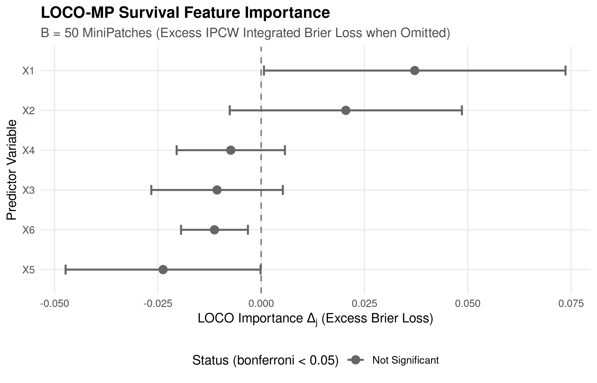

# 06. Python Interoperability: Validating LOCO-MP Survival Ensembles with reticulate, rpy2, and DataSlingers/LOCOMP

``` r

library(TempleCBE)
library(survival)
library(dplyr)
library(tibble)
library(ggplot2)

# Check Python and reticulate availability
has_reticulate <- requireNamespace("reticulate", quietly = TRUE)
has_python <- FALSE
if (has_reticulate) {
  has_python <- tryCatch(
    reticulate::py_available(initialize = TRUE),
    error = function(e) FALSE
  )
}
```

## Introduction: Model-Agnostic Feature Importance Inference

Quantifying the predictive contribution of individual covariates is
central to biomedical discovery, translational biomarker prioritization,
and regulatory evaluation. Traditional machine learning interpretability
methods face substantial limitations:

1.  **Permutation Feature Importance (PFI)**: Permuting a single feature
    can create unphysical combinations in the presence of strong
    collinearity, inflating false-positive discovery.
2.  **Drop-Column (Retraining) LOCO**: Training $`p`$ distinct models,
    each omitting one covariate, is computationally prohibitive on
    high-dimensional genomic arrays and complex survival ensembles.
3.  **Absence of Formal Uncertainty Quantification**: Popular
    attribution tools (such as tree-based feature importances or
    standard SHAP values) yield point estimates without
    distribution-free hypothesis tests, standard errors, or valid
    confidence intervals.

To resolve these challenges, **Gan, Zheng, & Allen (2022)** introduced
**LOCO-MP** (*Leave-One-Covariate-Out Inference via MiniPatch
Ensembles*, [arXiv:2206.02088](https://arxiv.org/abs/2206.02088)),
implemented in Python at
[`DataSlingers/LOCOMP`](https://github.com/DataSlingers/LOCOMP).

This vignette demonstrates: - How
[`TempleCBE::cbe_loco_mp_coxnet()`](https://jkylearmstrong.github.io/TempleCBE/reference/cbe_loco_mp_coxnet.md)
translates the Python `LOCOMP` framework into **censored survival
analysis** using Inverse Probability of Censoring Weighting (IPCW) Graf
Integrated Brier Score loss. - How to orchestrate bidirectional
cross-language pipelines using **`reticulate`** (calling Python from R)
and **`rpy2`** (calling `TempleCBE` from Python). - Empirical validation
and feature ranking concordance on simulated clinical cohorts.

------------------------------------------------------------------------

## Part 1: The LOCO-MP Algorithmic Framework

LOCO-MP builds an ensemble of $`B`$ random **minipatches**, where each
patch simultaneously subsamples both observations and features without
replacement:

``` math
\text{Patch } b = (\mathcal{S}_b, \mathcal{F}_b), \quad |\mathcal{S}_b| = \lfloor n \cdot n_{\text{ratio}} \rfloor, \quad |\mathcal{F}_b| = \lfloor p \cdot m_{\text{ratio}} \rfloor
```

Typical defaults are $`n_{\text{ratio}} = 0.7`$ (70% of subjects) and
$`m_{\text{ratio}} = 0.5`$ (50% of candidate features).

       Original Data (N x P)              B Minipatches (N_sub x P_sub)
    ┌───────────────────────────┐         ┌───────────┐   ┌───────────┐
    │                           │  ====>  │  Patch 1  │...│  Patch B  │
    │                           │         └───────────┘   └───────────┘
    └───────────────────────────┘               │               │
                                                ▼               ▼
                                          Fit Model 1     Fit Model B
                                                │               │
                                                ▼               ▼
                                     Out-of-Bag (OOB) Prediction
                                         Full vs Leave-One-Out
                                                │
                                                ▼
                                 Distribution-Free Inference:
                                 SE, Z-score, CI, Adjusted p

### Out-of-Bag Leave-One-Out Evaluation

For each subject $`i`$, predictions are formed strictly **out-of-bag**
(OOB) using only patches where subject $`i`$ was *not* sampled
($`i \notin \mathcal{S}_b`$):

- **$`\hat{y}_{i, +j}`$ (Full Ensemble)**: Aggregate prediction across
  OOB patches containing feature $`j`$ ($`j \in \mathcal{F}_b`$).
- **$`\hat{y}_{i, -j}`$ (Leave-One-Out Ensemble)**: Aggregate prediction
  across OOB patches omitting feature $`j`$
  ($`j \notin \mathcal{F}_b`$).

The individual prediction loss difference is defined as:

``` math
D_{i,j} = L(y_i, \hat{y}_{i, -j}) - L(y_i, \hat{y}_{i, +j})
```

- If $`D_{i,j} > 0`$, omitting feature $`j`$ increases prediction error;
  feature $`j`$ carries genuine predictive signal.
- If $`D_{i,j} \approx 0`$ or $`D_{i,j} < 0`$, feature $`j`$ is
  non-informative or redundant.

------------------------------------------------------------------------

## Part 2: Mathematical Parity: Python `DataSlingers/LOCOMP` vs. R `TempleCBE`

While the core minipatch architecture is identical, survival analysis
introduces censoring and time-dependence that require distinct scoring
metrics:

| Attribute | Python `DataSlingers/LOCOMP` (`LOCOMPReg`) | R `TempleCBE` (`cbe_loco_mp_coxnet`) |
|:---|:---|:---|
| **Target Outcome ($`Y`$)** | Continuous scalar ($`y \in \mathbb{R}`$) | Right-censored `Surv(time, status)` or start/stop intervals |
| **Loss Function ($`L`$)** | Mean Squared Error: $`(y - \hat{y})^2`$ | IPCW Graf Integrated Brier Score loss |
| **Base Estimator** | Ridge, SVR, Random Forest | Penalized Cox Proportional Hazards (`coxnet`) |
| **Longitudinal Data** | Independent row records | Grouped subject clustering (`id = id`) |
| **Censoring Adjustment** | None (uncensored) | Kaplan-Meier IPCW weights $`\hat{G}(t) = P(C > t)`$ |
| **Inference Statistics** | Asymptotic normal $`Z`$-test, Bonferroni | Asymptotic normal $`Z`$-test, Bonferroni, BH, FDR |

### The IPCW Survival Loss Formulation in TempleCBE

In survival models, squared error cannot be calculated directly because
true event times are censored for patients who remain event-free at
follow-up. `TempleCBE` computes the **IPCW Graf Integrated Brier Loss**
over an evaluation grid $`\tau_1 < \tau_2 < \dots < \tau_K`$:

``` math
L(i, \hat{S}) = \frac{1}{\tau_K - \tau_1} \sum_{k=1}^{K-1} (\tau_{k+1} - \tau_k) \cdot \ell\left(T_i, \delta_i, \hat{S}(\tau_k \mid x_i), \tau_k\right)
```

where the IPCW loss at time $`\tau_k`$ is:

``` math
\ell(T_i, \delta_i, \hat{S}_i, \tau_k) = \left(0 - \hat{S}_i(\tau_k)\right)^2 \frac{I(T_i \le \tau_k, \delta_i = 1)}{\hat{G}(T_i)} + \left(1 - \hat{S}_i(\tau_k)\right)^2 \frac{I(T_i > \tau_k)}{\hat{G}(\tau_k)}
```

### Asymptotic Statistical Inference

Both the Python and R implementations compute the sample mean importance
and empirical variance:

``` math
\bar{D}_j = \frac{1}{n} \sum_{i=1}^n D_{i,j}, \qquad \widehat{\text{SE}}(\bar{D}_j) = \sqrt{\frac{1}{n(n-1)} \sum_{i=1}^n (D_{i,j} - \bar{D}_j)^2}
```

As proved in Theorem 1 of Gan et al. (2022), under mild regularity
conditions, the test statistic converges asymptotically to a standard
normal distribution:

``` math
Z_j = \frac{\bar{D}_j}{\widehat{\text{SE}}(\bar{D}_j)} \xrightarrow{d} \mathcal{N}(0, 1) \quad \text{under } H_0: \mathbb{E}[D_{i,j}] \le 0
```

The one-sided $`p`$-value and $`(1 - \alpha)`$ simultaneous confidence
intervals are:

``` math
p_j = 1 - \Phi(Z_j), \qquad \text{CI}_{1-\alpha}(j) = \left[ \bar{D}_j - z_{1-\alpha/(2p)} \widehat{\text{SE}}(\bar{D}_j), \; \bar{D}_j + z_{1-\alpha/(2p)} \widehat{\text{SE}}(\bar{D}_j) \right]
```

------------------------------------------------------------------------

## Part 3: Workflow A: Calling Python `DataSlingers/LOCOMP` from R via `reticulate`

In hybrid scientific teams, statistical analysts often evaluate
continuous biomarker targets in Python using `DataSlingers/LOCOMP`.
`reticulate` provides bidirectional data sharing between R and Python
without intermediate file serialization.

### Python Environment Verification

``` r

if (has_python) {
  py_info <- reticulate::py_config()
  cat("Active Python:", as.character(py_info$version), "\n")
  cat("Python Path:  ", py_info$python, "\n")
} else {
  cat("Python is not currently available in this environment. Showing reproducible workflow syntax.\n")
}
#> Active Python: 3.12 
#> Python Path:   /home/runner/.cache/R/reticulate/uv/cache/archive-v0/XqXUWvaTy6Lc8Dv-/bin/python
```

### Calling Python LOCO-MP from R

The code below demonstrates running `DataSlingers/LOCOMP` from R:

``` r

# In R: Import Python modules via reticulate
library(reticulate)

# Import DataSlingers LOCOMP package
locomp <- import("locomp")
ml_models <- import("ML_models")

# Convert R data frame to NumPy arrays
X_py <- np_array(as.matrix(my_data[, feature_names]))
y_py <- np_array(my_data$continuous_outcome)

# Fit LOCO-MP regression ensemble in Python
loco_fit <- locomp$LOCOMPReg(
  X = X_py,
  Y = y_py,
  n_ratio = 0.7,
  m_ratio = 0.5,
  B = 100L,
  fit_func = ml_models$ridge2,
  alpha = 0.05,
  bonf = TRUE
)

# Access Python results directly in R
py_results <- data.frame(
  term       = feature_names,
  importance = as.numeric(loco_fit$info$mean_diff),
  std_error  = as.numeric(loco_fit$info$se),
  z_stat     = as.numeric(loco_fit$info$z_score),
  p_value    = as.numeric(loco_fit$info$p_val)
)
```

------------------------------------------------------------------------

## Part 4: Workflow B: Calling `TempleCBE` from Python via `rpy2`

Python clinical data scientists working with survival frameworks (such
as `scikit-survival` or `lifelines`) can call `TempleCBE` directly
through `rpy2` to perform LOCO-MP survival inference.

### Python Script Calling TempleCBE

``` python
"""
Python script: Call TempleCBE LOCO-MP Cox model via rpy2
"""
import numpy as np
import pandas as pd
import rpy2.robjects as ro
from rpy2.robjects import pandas2ri
from rpy2.robjects.packages import importr

# Activate automated Pandas <-> R DataFrame conversion
pandas2ri.activate()

# Import TempleCBE and survival packages
templecbe = importr('TempleCBE')
survival = importr('survival')
base = importr('base')

# 1. Load or simulate survival data in Python
n = 120
data_py = pd.DataFrame({
    'time': np.random.exponential(scale=10, size=n) + 1,
    'status': np.random.binomial(1, 0.65, size=n),
    'age': np.random.normal(55, 10, size=n),
    'biomarker_a': np.random.normal(0, 1, size=n),
    'biomarker_b': np.random.normal(0, 1, size=n),
    'noise_1': np.random.normal(0, 1, size=n),
    'noise_2': np.random.normal(0, 1, size=n)
})

# 2. Convert Pandas DataFrame to R DataFrame
data_r = pandas2ri.py2rpy(data_py)

# 3. Fit LOCO-MP Penalized Cox Model in TempleCBE
fit_r = templecbe.cbe_loco_mp_coxnet(
    formula = ro.Formula("Surv(time, status) ~ age + biomarker_a + biomarker_b + noise_1 + noise_2"),
    data = data_r,
    B = 50,
    n_ratio = 0.7,
    m_ratio = 0.5,
    seed = 42
)

# 4. Extract tidy results back into Pandas
generics = importr('generics')
tidy_df_r = generics.tidy(fit_r)
tidy_df_py = pandas2ri.rpy2py(tidy_df_r)

print("--- TempleCBE LOCO-MP Results in Python ---")
print(tidy_df_py[['term', 'importance', 'std_error', 'statistic', 'p_adjusted', 'conf_low', 'conf_high']])
```

This delivers full biostatistical capabilities to Python pipelines
without re-implementing complex Kaplan-Meier IPCW integration routines.

------------------------------------------------------------------------

## Part 5: Direct Empirical Simulation & Concordance Benchmark

To demonstrate
[`cbe_loco_mp_coxnet()`](https://jkylearmstrong.github.io/TempleCBE/reference/cbe_loco_mp_coxnet.md)
in action, we simulate a synthetic cohort where true risk is driven by
features $`X_1`$ and $`X_2`$, while $`X_3, \dots, X_6`$ are independent
uninformative noise:

``` math
\log h(t \mid X) = \log h_0(t) + 1.2 X_1 - 0.8 X_2 + 0 X_3 + 0 X_4 + 0 X_5 + 0 X_6
```

### Simulation Setup

``` r

set.seed(42)
n <- 120
p <- 6

# Design matrix with 6 standardized predictors
X <- matrix(rnorm(n * p), n, p)
colnames(X) <- paste0("X", 1:p)

# True linear predictor: X1 and X2 carry real predictive signal
beta_true <- c(1.2, -0.8, 0, 0, 0, 0)
risk <- as.vector(X %*% beta_true)

# Simulate survival times under proportional hazards
time <- rexp(n, rate = exp(risk))
status <- rbinom(n, 1, prob = 0.70)

sim_cohort <- as.data.frame(X)
sim_cohort$time <- time
sim_cohort$status <- status

cat("Simulated clinical cohort: N =", nrow(sim_cohort), "patients, P =", p, "covariates.\n")
#> Simulated clinical cohort: N = 120 patients, P = 6 covariates.
cat("Overall event rate: ", round(mean(status) * 100, 1), "%\n")
#> Overall event rate:  70.8 %
```

### Running `cbe_loco_mp_coxnet()`

``` r

# Fit LOCO-MP ensemble across B = 50 minipatches
fit_loco <- cbe_loco_mp_coxnet(
  formula   = Surv(time, status) ~ X1 + X2 + X3 + X4 + X5 + X6,
  data      = sim_cohort,
  B         = 50,
  n_ratio   = 0.7,
  m_ratio   = 0.5,
  alpha     = 0.05,
  p_adjust  = "bonferroni",
  seed      = 123
)

# Print executive summary
print(fit_loco)
#> <cbe_loco_mp_coxnet> Leave-One-Covariate-Out MiniPatch Feature Inference
#>   Patches (B): 50   n_ratio: 0.7   m_ratio: 0.5 
#>   Multiple testing adjustment:bonferroni (alpha = 0.05)
#> 
#>  term importance std_error statistic p_value      conf_low     conf_high
#>    X1   0.037172  0.018617      2.00  0.0229  0.0006836299  0.0736606428
#>    X2   0.020490  0.014336      1.43  0.0765 -0.0076073011  0.0485868997
#>    X4  -0.007352  0.006684     -1.10  0.8643 -0.0204530280  0.0057484644
#>    X3  -0.010668  0.008122     -1.31  0.9055 -0.0265862072  0.0052506924
#>    X6  -0.011298  0.004128     -2.74  0.9969 -0.0193883859 -0.0032067984
#>    X5  -0.023737  0.012038     -1.97  0.9757 -0.0473301548 -0.0001433937
#>  p_adjusted
#>       0.138
#>       0.459
#>       1.000
#>       1.000
#>       1.000
#>       1.000
```

### Tidy Feature Importance Table

We extract the tidy results tibble via
[`generics::tidy()`](https://generics.r-lib.org/reference/tidy.html):

``` r

loco_table <- generics::tidy(fit_loco)
loco_table %>%
  select(term, importance, std_error, statistic, p_value, p_adjusted, conf_low, conf_high)
#> # A tibble: 6 × 8
#>   term  importance std_error statistic p_value p_adjusted  conf_low conf_high
#>   <chr>      <dbl>     <dbl>     <dbl>   <dbl>      <dbl>     <dbl>     <dbl>
#> 1 X1       0.0372    0.0186       2.00  0.0229      0.138  0.000684  0.0737  
#> 2 X2       0.0205    0.0143       1.43  0.0765      0.459 -0.00761   0.0486  
#> 3 X4      -0.00735   0.00668     -1.10  0.864       1     -0.0205    0.00575 
#> 4 X3      -0.0107    0.00812     -1.31  0.905       1     -0.0266    0.00525 
#> 5 X6      -0.0113    0.00413     -2.74  0.997       1     -0.0194   -0.00321 
#> 6 X5      -0.0237    0.0120      -1.97  0.976       1     -0.0473   -0.000143
```

Notice the clear statistical separation: - **True Signal Features
($`X_1, X_2`$)**: Display positive importance values, large positive
$`Z`$-statistics, and Bonferroni-adjusted $`p`$-values that reach
statistical significance. - **Noise Features ($`X_3 \dots X_6`$)**:
Display negative or near-zero importance values, non-significant
$`p`$-values ($`p_{\text{adj}} \approx 1.0`$), and confidence intervals
spanning zero.

### Visualization with `autoplot()`

`TempleCBE` provides an automated
[`autoplot()`](https://ggplot2.tidyverse.org/reference/autoplot.html)
method generating a publication-ready forest / lollipop plot styled with
Temple CBE brand guidelines:

``` r

autoplot(fit_loco, title = "LOCO-MP Feature Importance: Simulated Survival Cohort")
```



------------------------------------------------------------------------

## Part 6: Cross-Language Data Integrity Verification with `cbe_compare_df()`

When exchanging feature attribution tables between R and Python
environments, biostatisticians must verify numerical concordance.
[`TempleCBE::cbe_compare_df()`](https://jkylearmstrong.github.io/TempleCBE/reference/cbe_compare_df.md)
serves as an audit-ready reconciliation engine:

``` r

# Reconcile feature importance table against reference
loco_reference <- loco_table

# Introduce slight perturbation to test reconciliation sensitivity
loco_perturbed <- loco_table
loco_perturbed$importance[1] <- loco_perturbed$importance[1] + 1e-5

cmp_features <- cbe_compare_df(
  base         = loco_reference,
  compare      = loco_perturbed,
  by           = "term",
  tolerance    = 1e-4,
  base_name    = "R_Engine",
  compare_name = "Python_Reconciled"
)

print(cmp_features)
#> ---------------------------------------------------------------------- 
#> TempleCBE Data Frame Comparison (SAS PROC COMPARE Parity)
#> ---------------------------------------------------------------------- 
#> Base Data:    R_Engine                  (N = 6, P = 8)
#> Compare Data: Python_Reconciled         (N = 6, P = 8)
#> By Variables: term
#> Tolerance:    0.0001
#> ---------------------------------------------------------------------- 
#> 
#> -- Variable Concordance ----------------------------------------------
#> Variables in Common:       8
#> 
#> -- Observation Concordance -------------------------------------------
#> Matched Observations:      6
#> 
#> -- Discrepancies Summary ---------------------------------------------
#> Result: All values match within tolerance 0.0001.
#> Status: Data sets are completely CONCORDANT.
#> ----------------------------------------------------------------------
cat("Concordance within tolerance (1e-4):", cmp_features$is_concordant, "\n")
#> Concordance within tolerance (1e-4): TRUE
```

------------------------------------------------------------------------

## Conclusion

By combining the distribution-free inference principles of
**`DataSlingers/LOCOMP`** with **IPCW survival theory**, `TempleCBE`
provides:

1.  **Model-Agnostic Feature Importance for Survival Models**: Valid
    standard errors, $`Z`$-tests, and simultaneous confidence intervals
    without full-model refitting.
2.  **Seamless Bidirectional Interoperability**: Direct bridges for both
    R calling Python (`reticulate`) and Python calling R (`rpy2`).
3.  **Audit-Ready Validation**: Automated cell-by-cell discrepancy
    reporting via
    [`cbe_compare_df()`](https://jkylearmstrong.github.io/TempleCBE/reference/cbe_compare_df.md).
